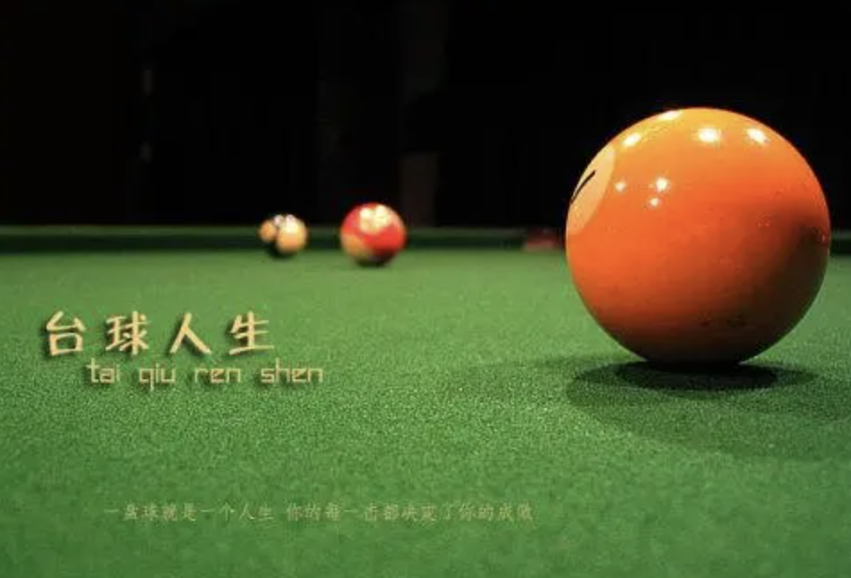

# 黑球、白球各 100，最后剩下一个是黑球的可能性

## 1. 题目 👇

一个桶里面有白球. 黑球各 `100` 个，现在按下述的规则取球：

- i. 每次从桶里面拿出来两个球；
- ii. 如果取出的是两个同色的球，就再放入一个黑球；
- iii. 如果取出的是两个异色的球，就再放入一个白球；

问：最后桶里面只剩下一个黑球的概率是多少？

## 2. 思考与解答

### 2.1 统计法

我们可一个用一个集合来表示桶中的黑球和白球的个数。
从桶中取出球后，只可能是下列三种操作：

1. 取出的是两个黑球，则放回一个黑球：`（-2，0）+（1，0）=（-1，0）`；
2. 取出的是两个白球，则放回一个黑球：`（0，-2）+（1，0）=（1，-2）`；
3. 取出的是一黑一白，则放回一个白球：`（-1，-1）+（0，1）=（-1，0）`；

根据上面的规则，我们可以发现：

白球的数量变化情况只能是不变或者 `-2`，也就是说，如果是 `100` 个白球，白球永远不可能是 `1` 个的情况，
那么问题的解法就很简单了，就是只剩下黑球的概率为 `100%`。

### 2.2 异或运算

两个相同的球异或等于 `0`，两个不同的球异或等于 `1`，所以就将黑球赋为 `0`，白球赋为 `1`，分别表示异或运算的结果。
下面给出异或运算的一些规律：

1. 偶数个 `1` 异或，结果为 `0`；
2. 偶数个 `0` 异或，结果为 `0`；
3. 奇数个 `1` 异或，结果为 `1`；
4. 奇数个 `0` 异或，结果为 `0`：

> 奇数个的情况，可以理解为 `奇数 = 偶数 + 1`，所以根据偶数个的情况即可得到结果。

可以作这样的抽象：每次捞出两个数字做一次异或操作，并将所得的结果丢回桶中。
因此最后的结果实际上相当于把所有的球都进行一次异或运算，最后所得的结果即为最后剩余的球。

就有可能是 `0 ^ 1 ^ 1 ^ 0 ……` 之类的情况，又因为异或运算满足`结合律`，上式可变为：

`（0 ^ 0 ……^ 0） ^ （1 ^ 1 ……^ 1）` 两边都是 `100` 个，结果就是 `0`，所以结果只能是黑球，就是只剩下黑球的概率为 `100%`。

## 3. 参考

- [黑球、白球各 100，最后剩下一个是黑球的可能性｜编程之美&百度&腾讯](https://mp.weixin.qq.com/s/meES9OFQik-xHReAwlhJmA)
