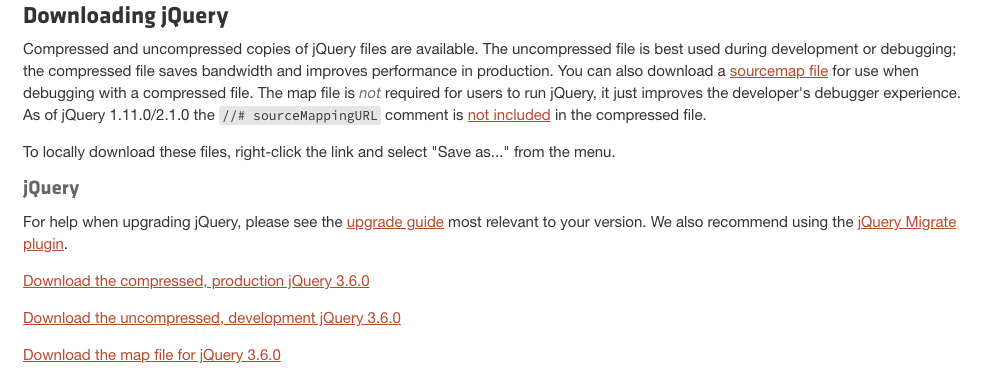
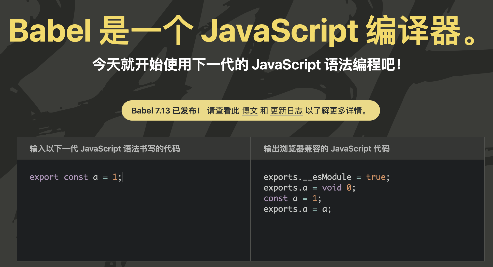
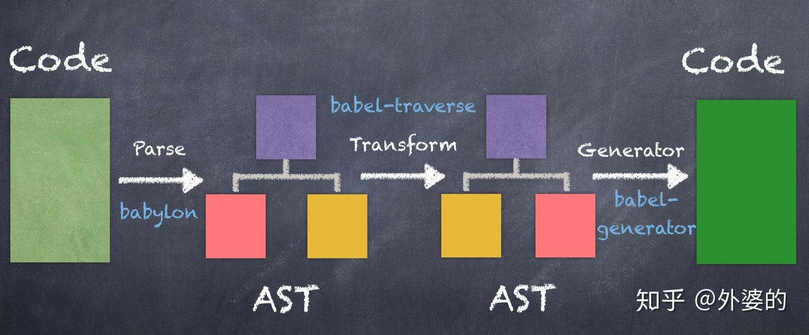
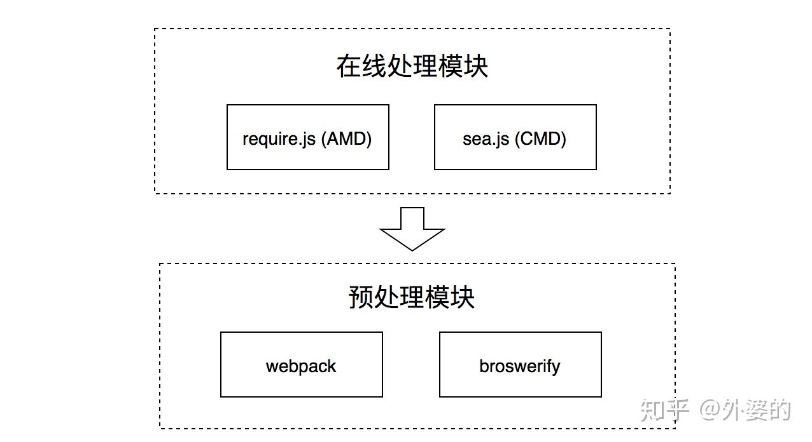
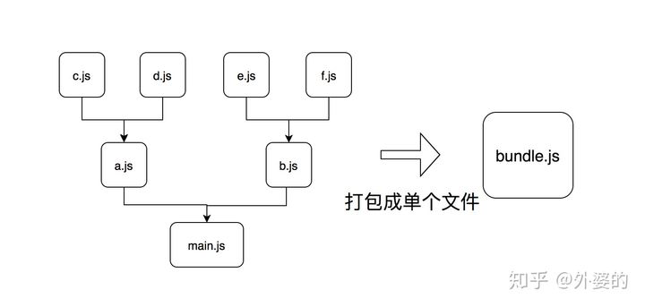
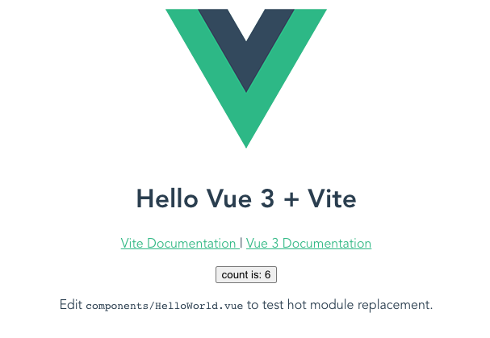

# 前端模块化的发展历程

> 基于参考资料，按目前最新的代码实现，给有需要的同学作为参考。

这是一篇关于前端模块化的文章，但这里并不讲实现原理和新技术，而是谈一谈——历史。

> 夫以铜为镜，可以正衣冠；以史为镜，可以知兴替 ——《旧唐书·魏徵传》

## 1. 前言

也许在谈论具体的内容之前，我们需要谈论一下关键词的定义。
什么是"模块"？在不同的语境下模块有不同的含义。

但在本文中，我们从广义的角度出发，将它解释为两个方面：

- 外部的模块: 指代引入前端工程的某个外部的包（package），可能由多个 JS 文件组成，但会通过入口暴露给我们项目调用；
- 内部的模块: 指代我们自己的工程项目中编码的最小单元： 即单个的 JS 文件；

模块化已经发展了有十余年了，不同的工具和轮子层出不穷，但总结起来，它们解决的问题主要有三个：

- 外部模块的管理
- 内部模块的组织
- 模块源码到目标代码的编译和转换

## 2. 发展时间线

下面是最各大工具或框架的诞生时间，不知不觉，模块化的发展已有十年之久了。

| 生态             | 诞生时间 |
| ---------------- | -------- |
| `Node.js`        | 2009 年  |
| `NPM`            | 2010 年  |
| `requireJS(AMD)` | 2010 年  |
| `Angular1`       | 2010 年  |
| `seaJS(CMD)`     | 2011 年  |
| `broswerify`     | 2011 年  |
| `webpack`        | 2012 年  |
| `grunt`          | 2012 年  |
| `gulp`           | 2013 年  |
| `react`          | 2013 年  |
| `vue`            | 2014 年  |
| `redux`          | 2015 年  |
| `rollup`         | 2015 年  |
| `Angular2`       | 2016 年  |
| `vite`           | 2020 年  |
| `snowpack`       | 2020 年  |

> `Angular2` 不是从 `Angular1` 升级过来的, `Angular2` 是重写的。所以 `Angular1` 和 `Angular2` 不是一个框架。

## 3. 外部模块的管理

在模块化的过程中，首先要解决的就是`外部模块的管理问题`。

### 3.1 Node.js 和 NPM 的发布

时间倒回到 `2009` 年，一个叫 `Ryan Dahl` 的大佬创立了一个能够运行 `JavaScript` 的服务器环境——`Node.js`, 并在一年之后，发布了 `Node.js` 自带的模块管理工具 `npm`, `npm` 的全称是 `node package manager`, 也就是 `Node` 包管理器。

`Node` 的出现给 `JavaScript` 的带来了许多改变：

- 一方面, `Node` 使 `JavaScript` 不局限于前端，同时还成为了一门后端语言。
- 更重要的是: 经过 `10` 年的发展, `Node.js` 已经完全融入到了前端开发流程中。我们用它创建静态资源服务器，实现热重载和跨域代理等功能，同时还用它源代码中的特殊写法做编译转换处理(`JSX/Sass/TypeScript`)，将代码翻译成浏览器可以理解的格式(`ES5/CSS`)。

到今天，即使我们不用 `Node.js` 独立开发程序后台，它作为开发工具的重要性也不会改变。

另一方面, `Node.js` 自带的 `JS` 模块管理工具 `npm`, 从根本上改变了前端使用外部模块的方式，如果要打个比方的话，就好比从原始社会进入了现代社会。

### 3.2 NPM 时代以前的外部模块使用方式

在一开始没有 `npm` 的时候，如果我们需要在项目里使用某个外部模块，我们可能会去官网直接把文件下载下来放到项目中，同时在入口 `html` 中通过 `script` 标签引用它。

以 [jQuery 下载](https://jquery.com/download/) 为例：



每引用一个外部模块，我们都要重复这个过程：

- 需要用到 `jQuery`, 去 `jQuery` 官网下载 `jQuery` 库，导入到项目中；
- 需要用到 `lodash`, 去 `lodash` 官网下载 `lodash` 库，导入到项目中；
- 需要用到某个 `Bootstrap`, 去 `Bootstrap` 官网官网下载 `Bootstrap` 库，导入到项目中；
- ...

在线导入项目方式：

```html
<!-- index.html -->
<script src="https://code.jquery.com/jquery-3.6.0.min.js"></script>
```

除了这些全局的 `UI` 库或工具库，我们可能还会使用到很多实现细节功能的辅助模块，如果都按这种方式使用未免过于粗暴，而且给我们带来许多麻烦：

- 使用上缺乏便利性；
- 难以跟踪各个外部模块的来源；
- 没有统一的版本管理机制；

而 `npm` 的出现改变了这种情况。

### 3.3 NPM 时代以后外部模块的使用方式

我们上面说过, `NPM` 在 `2010` 年伴随着 `Node.js` 的新版本一起发布，是一个 `Node` 自带的模块管理工具。

从概念上看它由以下两个部分组成：

- `NPM` 是一个远程的 `JavaScript` 代码仓库，所有的开发者都可以向这里提交可共享的模块，并给其他开发者下载和使用；
- `NPM` 还包含一个命令行工具，开发者通过运行 `npm publish` 命令把自己写的模块发布到 `NPM` 仓库上去，通过运行 `npm install [模块名]`，可以将别人的模块下载到自己项目根目录中一个叫 `node_modules` 的子目录下；

**初始化 package.json**

```bash
npm init
# This utility will walk you through creating a package.json file.
# It only covers the most common items, and tries to guess sensible defaults.

# See `npm help json` for definitive documentation on these fields
# and exactly what they do.

# Use `npm install <pkg>` afterwards to install a package and
# save it as a dependency in the package.json file.

# Press ^C at any time to quit.
# package name: npm-demo
# version: (1.0.0)
# description: npm安装依赖Demo
# entry point: (index.js)
# test command:
# git repository:
# keywords:
# author:
# license: (ISC)
# About to write to package.json:

# {
#   "name": "npm-demo",
#   "version": "1.0.0",
#   "description": "npm安装依赖Demo",
#   "main": "index.js",
#   "dependencies": {},
#   "devDependencies": {},
#   "scripts": {
#     "test": "echo \"Error: no test specified\" && exit 1"
#   },
#   "author": "",
#   "license": "ISC"
# }

# Is this OK? (yes) yes
```

**安装依赖**

```bash
npm install --save jquery
# npm WARN npm-demo@1.0.0 No repository field.

# + jquery@3.6.0
# updated 1 package in 0.338s
```

**项目结构**

```
.
├── node_modules
|    └── jquery
├── package-lock.json
└── package.json
```

**package.json**

```json
// package.json
{
  // ...
  "dependencies": {
    "jquery": "^3.6.0"
  }
  // ...
}
```

于是乎，包括 `jQuery` 等知名模块开发者的前端工程师们，都通过 `npm publish` 的方式把自己的模块发布到 `NPM` 上去了。
前端开发者们真正有了一个属于自己的社区和平台，如万千漂泊游船归于港湾，而 `NPM` 也名声渐噪。

早在 `2019` 年 `6` 月, `NPM` 平台上的模块数量就超过了 `100` 万，而到写下这篇文章的时候, `NPM` 模块数量已超过了 `160` 万。
最新包数量详见[npm 官网](https://www.npmjs.com/)。

> 注：需要登录后才可查看。


`NPM` 的出现实际上是一个必然，前端工程的复杂化要求我们必须要有这么一个集中的 `JS` 库管理平台。
但为什么它会是 `NPM` 呢？这和后来 `Node.js` 的火热有很大关系，因为 `NPM` 是 `Node.js` 内置的包管理器，所以跟随着 `Node` 得到了开发者的追捧。

综上所述, `NPM` 解决了外部模块的管理问题。

## 4. 内部模块的组织

在模块化的过程中，还需要解决的是内部模块的组织问题。

### 4.1 模块化第一阶段：原生 JS 组织阶段

在最原始的时代，我们是通过下面这种方式组织我们的模块代码的，将不同的 `JS` 文件在 `html` 中一一引入。每个文件代表一个模块。

```html
<!-- index.html -->
<script src="./a.js"></script>
<script src="./b.js"></script>
<script src="./c.js"></script>
<script src="./d.js"></script>
```

并通过模块模式去组织代码：如下所示，我们通过一个`“立即调用的函数表达式”(IIFE)`去组织模块。

- 将每个模块包裹在一个函数作用域里面执行，这样就可以最大程度地避免污染全局执行环境；
- 通过执行匿名函数得到模块输出，可以暴露给下面的其他模块使用；

```html
<!-- a.js -->
<script>
  var module1 = (function () {
    var x = 1;
    return { a: x };
  })();
</script>

<!-- b.js -->
<script>
  var module2 = (function () {
    var a = module1.a;
    return { b: a };
  })();
</script>
```

但这种使用方式仍然比较粗暴：

- 随着项目扩大, `html` 文件中会包含大量 `script` 标签。
- `script` 标签的先后顺序并不能很好地契合模块间的依赖关系。在复杂应用中，模块的依赖关系通常树状或网状的，如 `a.js` 依赖于 `b.js` 和 `c.js`, `b.js` 依赖于 `b1.js` 和 `b2.js`。相对复杂的依赖关系难以用 `script` 标签的先后顺序组织。
- 让代码的逻辑关系难以理解，也不便于维护，容易出现某个脚本加载时依赖的变量尚未加载而导致的错误。
- 因为对 `script` 标签顺序的要求而使用同步加载，但这却容易导致加载时页面卡死的问题
- 仍然会因为全局变量污染全局环境，导致命名冲突。

我们需要针对这些问题提出解决方案，而 `AMD` 和 `CMD` 就是为解决这些问题而提出的规范。

### 4.2 模块化的第二阶段：在线处理阶段

#### 4.2.1 模块化规范的野蛮生长

`10` 多年以前，前端模块化刚刚开始，正处在野蛮生长的阶段。
这个过程中诞生了诸多模块化规范: `AMD/CMD/CommonJS/ES6 Module`。
没错，前端并没有一开始就形成统一的模块化规范，而是多个规范同时多向发展。
直到某一类规范占据社区主流之时，模块化规范野蛮生长的过程才宣告结束。

首先开始在前端流行的模块化规范是 `AMD/CMD`, 以及实践这两种规范的 `require.js` 和 `sea.js`, `AMD` 和 `CMD` 可看作是`"在线处理"`模块的方案。
也就是等到用户浏览 `web` 页面下载了对应的 `require.js` 和 `sea.js` 文件之后，才开始进行模块依赖分析，确定加载顺序和执行顺序。
模块组织过程在线上进行。

#### 4.2.2 AMD && CMD

> `AMD` 和 `CMD` 只是一种设计规范，而不是一种实现。

- [AMD 规范查看](https://github.com/amdjs/amdjs-api/wiki/AMD)
- [CMD 规范查看](https://github.com/seajs/seajs/issues/242)

##### 4.2.2.1 AMD 规范

> The Asynchronous Module Definition (AMD) API specifies a mechanism for defining modules such that the module and its dependencies can be asynchronously loaded. This is particularly well suited for the browser environment where synchronous loading of modules incurs performance, usability, debugging, and cross-domain access problems.
>
> 异步模块定义规范(`AMD`)制定了定义模块的规则，这样模块和模块的依赖可以被异步加载。这和浏览器的异步加载模块的环境刚好适应（浏览器同步加载模块会导致性能、可用性、调试和跨域访问等问题）。

我们先来说下 `AMD`, 它的全称是 `Asynchronous Module Definition`, 即“异步模块定义”。
它是一种组织前端模块的方式。

> `AMD` 的理念可以用如下两个 `API` 概括: `define` 和 `require`。
> 以下为伪代码，具体可参考 [requireJS 官网示例](https://requirejs.org/docs/api.html)。

**define 说明：**

```js
define(id, deps, factory);
```

| argument | type     |
| -------- | -------- |
| id       | string   |
| deps     | array    |
| factory  | function |

> All modules must have IDs and dependency arrays in their define() calls.

```js
// dep1.js
define('dep1', [], () => {});
// dep2.js
define('dep2', [], () => {});

// module1.js
define('module1', ['dep1', 'dep2'], (dep1, dep2) => {
  // initial setup
  return {
    // exports
  };
});
```

**require 说明：**

`require` 用于真正执行模块，通常 `AMD` 框架会以 `require` 方法作为入口，进行依赖关系分析并依次有序地进行加载。

```js
require(deps, factory);
```

| argument | type     |
| -------- | -------- |
| deps     | array    |
| factory  | function |

```js
require(['module1', 'module2'], (module1, module2) => {
  // modules module1 and module2 are now available for use.
});
```

**define && require 的区别**

可以看到 `define` 和 `require` 在依赖模块声明和接收方面是一样的，它们的区别在于 `define` 能自定义模块而 `require` 不能。
`require` 的作用是执行模块加载。

**通过 AMD 规范组织后的 JS 文件看起来像下面这样：**

```
目录结构
.
├── js
|    ├── app.js
|    └── depModule.js
└── index.html
```

```js
// depModule.js
define('depModule', [], () => {
  return {
    printSth() {
      console.log('something');
    },
  };
});

// app.js
define('app', ['depModule'], (depModule) => {
  depModule.printSth();
});
```

```html
<!-- index.html -->

<!-- amd.js意为某个实现了AMD规范的库 -->
<script src="...amd.js"></script>

<script>
  require.config({
    paths: {
      app: "js/app",
      depModule: "js/depModule",
    },
  });

  require(["app"], function (app) {
    // ...入口文件
  });
</script>
```

我们可以看到, `AMD` 规范去除了纯粹用 `script` 标签顺序组织模块带来的问题：

- 通过依赖数组的方式声明依赖关系，具体依赖加载交给具体的 `AMD` 框架处理；
- 避免声明全局变量带来的环境污染和变量冲突问题；
- 正如 `AMD` 其名所言(`Asynchronous`), 模块是异步加载的，防止 `JS` 加载阻塞页面渲染；

> `AMD` 只是一个倡议的规范，那么它有哪些实现呢？
> 已知的 `AMD` 的主流框架是在 `2010` 年推出 `requireJS`。
> [requireJS 官网介绍](https://requirejs.org/docs/api.html)


> 时隔多年，再次看到这个 `logo` 有种莫名的熟悉感`&_&`

##### 4.2.2.2 CMD 规范

`CMD` 是除 `AMD` 以外的另外一种模块组织规范。`CMD` 即 `Common Module Definition`, 意为“通用模块定义”。
和 `AMD` 不同的是, `CMD` 没有提供前置的依赖数组，而是接收一个 `factory` 函数，这个 `factory` 函数包括 `3` 个参数：

- `require`: 一个方法标识符，调用它可以动态的获取一个依赖模块的输出；
- `exports`: 一个对象，用于对其他模块提供输出接口，例如: `exports.name = "xxx"`；
- `module`: 一个对象，存储了当前模块相关的一些属性和方法，其中 `module.exports` 属性等同于上面的 `exports`；

如下所示：

```js
// CMD
define((requie, exports, module) => {
  // 依赖就近书写
  const module1 = require('Module1');
  const result1 = module1.exec();

  module.exports = {
    result1,
  };
});

// AMD
define(['Module1'], (module1) => {
  const result1 = module1.exec();

  return {
    result1,
  };
});
```

**CMD && AMD 的区别**

从上面的代码比较中我们可以得出 `AMD` 规范和 `CMD` 规范的区别：

- 一方面，在依赖的处理上：
  - `AMD` 推崇依赖前置，即通过依赖数组的方式提前声明当前模块的依赖；
  - `CMD` 推崇依赖就近，在编程需要用到的时候通过调用 `require` 方法动态引入；
- 另一方面，在本模块的对外输出上：
  - `AMD` 推崇通过返回值的方式对外输出；
  - `CMD` 推崇通过给 `module.exports` 赋值的方式对外输出；

**遵循 CMD 规范实现的模块加载器**

`sea.js` 是遵循 `CMD` 规范实现的模块加载器，又或者更准确的说法是: `CMD` 正是在 `sea.js` 推广的过程中逐步确立的规范，并不是 `CMD` 诞生了 `sea.js`。
相反，是 `sea.js` 诞生了 `CMD`。

> `CMD` 和 `AMD` 并不是互斥的, `require.js` 和 `sea.js` 也并不是完全不同。
> 实际上，通过阅读 `API` 文档我们会发现, `CMD` 后期规范容纳了 `AMD` 的一些写法，详见[CMD 支持 AMD 写法](https://github.com/seajs/seajs/issues/242)
> 而 `AMD` 也容纳了 `CMD` 的一些做法，详见[requireJS 支持 CMD 写法](https://requirejs.org/docs/api.html#cjsmodule)

##### 4.2.2.3 AMD && CMD 背后的实现原理

- [Seajs 源码解读](https://segmentfault.com/a/1190000016001572)
- [RequireJS 框架源代码解析](https://mp.weixin.qq.com/s/nqIG4XmMJuYp7dms5PkWpA)

> 注：写这篇文章的时候, `Seajs` 官网已经访问不到了，域名也在对外开发购买状态。虽没用过，但还是要向大佬致敬。
> 这里就不再详细赘述了，有兴趣同学可以看下。

#### 4.2.3 ES6 的模块化风格

关于 `AMD/CMD` 的介绍到此为止，后面的事情我们都知道了。
伴随着 `babel` 等编译工具和 `webpack` 等自动化工具的出现，`AMD/CMD` 逐渐湮没在历史的浪潮当中。
然后大家都习惯于用 `CommonJS` 和 `ES6` 的模块化方式编写代码了。

这一切是怎么发生的呢？ 请继续看。

**CommonJS && ES6**

`CommonJS` 是 `Node.js` 使用的模块化方式，而 `import/export` 则是 `ES6` 提出的模块化规范。
它们的语法规则如下。

```js
// ES6
import { foo } from './foo'; // 输入
export const bar = 1; // 输出
```

```js
// CommonJS
const foo = require('./foo'); // 输入
module.exports = {
  bar: 1, // 输出
};
```

实际上我们能感觉到，这种模块化方式用起来比 `CMD/AMD` 方便。
但在最开始的时候，我们却不能在前端页面中使用它们，因为浏览器并不能理解这种语法。
但后来，编译工具 Babel 的出现让这变成了可能。

#### 4.2.4 Babel 的出现和 ES6 模块化的推广

在 `2014` 年十月, `Babel 1.7` 发布。
`Babel` 是一个 `JavaScript` 编译器，它让我们能够使用符合开发需求的编程风格去编写代码，然后通过 `Babel` 的编译转化成对浏览器兼容良好的 `JavaScript`。

`Babel` 的出现改变了我们的前端开发观点。
它让我们意识到：对前端项目来说，开发的代码和生产的前端代码可以是不一样的，也应该是不一样的。

- 在开发的时候，我们追求的是编程的便捷性和可阅读性。
- 而在生产中，我们追求的是代码对各种浏览器的兼容性。

`Babel` 编译器让我们能做到这一点。
在 `Babel` 出现之前的 `AMD/CMD` 时代，开发和生产的代码并没有明显的区分性，开发是怎样的生产也就是怎样的。

而 `Babel` 则将开发和生产这两个流程分开了，同时让我们可以用 `ES6` 中的 `import/export` 进行模块化开发。
至此, `AMD/CMD` 的时代宣告结束，ES6 编程的时代到来。

[Babel 文档查看](https://www.babeljs.cn/docs/)


#### 4.2.5 Babel 的工作原理

`Babel` 的工作流程可概括为三个阶段：

- `Parse`(解析): 通过词法分析和语法分析，将源代码解析成抽象语法树(AST)；
- `Transform`(转换)：对解析出来的抽象语法树做中间转换处理；
- `Generate`(生成)：用经过转换后的抽象语法树生成新的代码；




### 4.3 模块化的第三阶段：预处理阶段

现在时间来到了 `2013` 年左右, `AMD/CMD` 的浪潮已经逐渐退去，模块化的新阶段——预编译阶段开始了。

一开始的 `CMD/AMD` 方案，可看作是“在线编译”模块的方案，也就是等到用户浏览 `web` 页面下载了 `js` 文件之后，才开始进行模块依赖分析，确定加载顺序和执行顺序。但这样却不可避免的带来了一些问题：

- 在线组织模块的方式会延长前端页面的加载时间，影响用户体验。
- 加载过程中发出了海量的 `http` 请求，降低了页面性能。

**于是开发者们想了对应的方法去解决这些问题：**

- 开发一个工具，让它把组织模块的工作提前做好，在代码部署上线前就完成，从而节约页面加载时间；
- 使用工具进行代码合并，把多个 `script` 的代码合并到少数几个 `script` 里，减少 `http` 请求的数量；



在这样的背景下，一系列模块预处理的工具如雨后春笋般出现了。

典型的代表是 `2011` 年出现的 `broswerify` 和 `2012` 年发明的 `webpack`。


它们一开始的定位是类似的，都是通过预先打包的方式，把前端项目里面的多个文件打包成单个文件或少数几个文件。
这样的话就可以压缩首次页面访问时的 `http` 请求数量，从而提高性能。



当然后面的事情我们都知道了, `webpack` 因为发展得更好而占据了主流的前端社区，而 `broswerify` 则渐渐消失在红尘之中。

[browserify 官网](http://browserify.org/)
[webpack 官网](https://webpack.docschina.org/)

#### 4.3.1 broswerify

以 `broswerify` 为例，我们可以通过 `npm` 安装它。

```bash
npm install --save-dev browserify
```

`broswerify` 允许我们通过 `CommonJS` 的规范编写代码，例如下面的入口文件 `main.js`。

```js
// main.js
const a = require('./a.js');
const b = require('./b.js');
// ...
```

```js
// a.js
module.exports = {
  a: 123,
};
```

然后我们可以用 broswerify 携带的命令行工具处理 main.js，它会自动分析依赖关系并进行打包，打包后会生成集合文件 bundle.js。

```
npx browserify src/main.js -o dist/bundle.js
```

[npx 命令说明](https://www.ruanyifeng.com/blog/2019/02/npx.html)

#### 4.3.2 webpack

`webpack` 是自 `broswerify` 出现一年以后，后来居上并占据主流的打包工具。
`webpack` 内部使用 `babel` 进行解析，所以 `ES6` 和 `CommonJS` 等模块化方式是可以在 `webpack` 中自由使用的。

通过安装 `webpack` 这一 `npm` 模块便可使用 `webpack` 工具。

```bash
npm install --save-dev webpack webpack-cli
```

它要求我们编写一份名为 `webpack.config.js` 的配置文件，并以 `entry` 字段和 `output` 字段分别表示打包的入口和输出路径。

```js
// webpack.config.js
module.exports = {
  mode: 'development', // development为开发环境，production为生产环境
  entry: path.resolve(__dirname, 'src/main.js'), // 入口文件
  output: {
    path: path.resolve(__dirname, 'dist'), // 打包后的文件存放的地方
    filename: 'bundle.js', // 打包后输出文件的文件名
  },
};
```

执行以下命令即可实现打包。

```bash
npx webpack --config webpack.config.js
```

打包完毕后，我们的 `index.html` 只需要加载 `dist/bundle.js` 就可以了。

#### 4.3.3 打包工具面临的问题 && 解决方案

代码打包当然不是一本万利的，它们也面临着一些副作用带来的问题，其中最主要的就是打包后代码体积过大的问题。

代码打包的初衷是减少类似 `CMD` 框架造成的加载脚本(`http` 请求)数量过多的问题，但也带来了打包后单个 `script` 脚本体积过大的问题：
如此一来，首屏加载会消耗很长时间并拖慢速度，可谓是物极必反。

`webpack` 于是引入了代码拆分的功能(`Code Splitting`)来解决这个问题, 从全部打包后退一步：
可以打包成多个包。

> 虽然允许拆多个包了，但包的总数仍然比较少，比 `CMD` 等方案加载的包少很多。

**Code Splitting 又可分为两个方面的作用：**

- 一是实现第三方库（或公共代码）和业务代码的分离：
  业务代码更新频率快，而第三方库代码更新频率是比较慢的。
  分离之后可利用浏览器缓存机制加载第三方库，从而加快页面访问速度。

- 二是实现按需加载:
  例如我们经常通过前端路由分割不同页面，除了首页外的很多页面(路由)可能访问频率较低，我们可将其从首次加载的资源中去掉。
  而等到相应的触发时刻再去加载它们。
  这样就减少了首屏资源的体积，提高了页面加载速度。

**A.实现第三方库（或公共代码）和业务代码的分离**

这种代码拆分可通过 `webpack` 独特的插件机制完成。

> 注：[CommonsChunkPlugin](https://webpack.docschina.org/plugins/commons-chunk-plugin/) 已经在 `webpack v4` 版本中被删除。
> 要了解在最新版本中块是如何处理的，请查看 [splitchunkplugin](https://webpack.docschina.org/plugins/split-chunks-plugin/)。

```js
module.exports = {
  mode: 'development', // development为开发环境，production为生产环境
  entry: path.resolve(__dirname, 'src/main.js'), // 入口文件
  output: {
    path: path.resolve(__dirname, dist), // 打包后的文件存放的地方
    filename: 'bundle.js', // 打包后输出文件的文件名
  },
  optimization: {
    // 配置详见：https://webpack.docschina.org/plugins/split-chunks-plugin/
    splitChunks: {
      cacheGroups: {
        // 第三方开源库单独打包
        commons: {
          chunks: 'all',
          // 当 webpack 处理文件路径时，它们始终包含 Unix 系统中的 / 和 Windows 系统中的 \。这就是为什么在 {cacheGroup}.test 字段中使用 [\\/] 来表示路径分隔符的原因。{cacheGroup}.test 中的 / 或 \ 会在跨平台使用时产生问题。
          test: /[\\/]node_modules[\\/]/,
          priority: -10,
          reuseExistingChunk: true,
          // cacheGroupKey here is `commons` as the key of the cacheGroup
          name(module, chunks, cacheGroupKey) {
            return `${cacheGroupKey}`;
          },
          filename: '[name].bundle.js',
        },
        // 业务项目公共代码单独打包
        vendors: {
          chunks: 'all',
          minChunks: 2,
          priority: -20,
          reuseExistingChunk: true,
          // cacheGroupKey here is `vendors` as the key of the cacheGroup
          name(module, chunks, cacheGroupKey) {
            return `${cacheGroupKey}`;
          },
          filename: '[name].bundle.js',
        },
      },
    },
  },
};
```

执行打包命令：

```bash
npx webpack --config webpack.config.js
```

我们发现生成以下文件：

```
.
├── dist
|    ├── bundle.js
|    ├── vendors.bundle.js
|    └── commons.bundle.js
```

**B.实现按需加载**

正如其字面意思，按需加载就是等到需要的时候才加载一部分模块。
并不选择将其代码打包到首次加载的入口 `bundle` 中，而是等待触发的时机，届时才通过动态脚本插入的方式进行加载:
即创建 `script` 元素，添加脚本链接并通过 `appendChild` 加入到 `html` 元素中。

例如我们需要实现一个功能，在点击某个按钮的时候，使用某个模块的功能。这时我们可以使用 `ES6` 的 `import` 语句动态导入, `webpack` 会支持 `import` 的功能并实现按需加载。

```js
// main.js

// ...
document.querySelector('#btn').addEventListener('click', () => {
  import('./async.js').then((data) => {
    console.log(data);
  });
});
// ...
```

执行完打包命令后：

```
.
├── dist
|    ├── bundle.js
|    ├── vendors.bundle.js
|    ├── src_async_js.bundle.js
|    └── commons.bundle.js
```

### 4.4 模块化的第四阶段：自动化构建阶段

正当打包工具方兴未艾的时候，另外一个发展浪潮也几乎在同步发生着。

它就是 —— 全方位的自动化构建工具的发展。

什么叫自动化构建工具呢？
简单的说就是： 我们需要这样一个工具，专门为开发过程服务，尽可能满足我们开发的需求，提高开发的效率。

前面说过，在模块化的过程中，我们渐渐有了“开发流程”和“生产流程”的区分，而自动化构建工具就是在开发流程中给开发者最大的自由度和便捷性，同时在生产流程中能保证浏览器兼容性和良好性能的工具。而所有的功能已经由插件直接提供，所以被称作“自动化” 构建工具。


在这时，我们已经不再满足于“打包”这个功能了，我们渴望做更多的事情：

- 开发时使用丰富且方便的 `JS` 新特性，如用 `ES6`, `typescript` 编程，由自动化构建工具转化成浏览器兼容的 `ES5` 格式的 `JS` 代码；
- 用 `Sass`, `Less` 编写阅读性和扩展性良好的样式代码，由自动化构建工具转化成浏览器兼容的 `CSS` 代码；
- 提供开发时 `SourceMap` 功能，也即提供生产代码(如 `ES5`)到源代码(`typescript`)的映射，方便开发调试；
- 提供生产时代码压缩功能，压缩 `js` 和 `css`, 删除注释，替换变量名(长变短)，减少代码加载体积；
- 提供开发热重载功能(`Hot Module Reload`), 也即在编辑器保存代码的时候自动刷新浏览调试页面；
- 当然也还包括基本的模块打包功能
- 其他.....

自动化构建工具的代表性工具有四个，分别是：

- `2012` 年出现的 [webpack](https://webpack.docschina.org/)；
- `2012` 年出现的 [grunt](https://www.gruntjs.net/)；
- `2013` 年出现的 [gulp](https://www.gulpjs.com.cn/)；
- `2015` 年出现的 [rollup](https://www.rollupjs.com/)；

**grunt vs gulp**

上手难度：

- `gulp` 实现包括 `require`(引入模块), `gulp.task`(定义任务名称、任务执行)两部分；
- 而 `grunt` 实现包括 `grunt.initConfig`(任务执行)、`grunt.loadNpmTasks`(引入模块)、`grunt.registerTask`(定义任务名称)三部分；

执行效率：

- `grunt` 默认配置不支持并行处理；
- `gulp` 原生支持并行处理配置；

综上：

- `gulp` 比 `grunt` 更容易掌握且能灵活实现个性化任务处理。
- 而 `grunt` 自然就像过去的 `Sea.js`, `Require.js` 等工具一样，逐渐地从热潮中隐退，静静地待在前端社区里的一方僻静的角落里。

**加强版 webpack**

这一次, `webpack` 并没有止步于成为一个单纯的打包工具，而是参与到自动化构建的浪潮里，再次引领前端工具的发展。

`webpack` 的特点：

- 代码分割

  - `Webpack` 有两种组织模块依赖的方式，同步和异步。
  - 异步依赖作为分割点，形成一个新的块。在优化了依赖树后，每一个异步区块都作为一个文件被打包。

- `Loader`(加载器)

  - `Webpack` 本身只能处理原生的 `JavaScript` 模块，但是 `loader` 转换器可以将各种类型的资源转换成 `JavaScript` 模块。
  - 这样，任何资源都可以成为 `Webpack` 可以处理的模块。

- 智能解析

  - `Webpack` 有一个智能解析器，几乎可以处理任何第三方库，无论它们的模块形式是 `CommonJS`、`AMD` 还是普通的 `JS` 文件。
  - 甚至在加载依赖的时候，允许使用动态表达式 `require("./templates/" + name + ".jade")`。

- 插件系统

  - `Webpack` 还有一个功能丰富的插件系统。
  - 大多数内容功能都是基于这个插件系统运行的，还可以开发和使用开源的 `Webpack` 插件，来满足各式各样的需求。

**后起之秀 Rollup**

`2017` 年 `4` 月份的时候, `Facebook` 将 `React` 的构建工具换成了 `Rollup`。
很多人就有疑问了, `Webpack` 不也是 `Facebook` 团队开发的吗，为什么不使用它而是要换成第三方构建工具呢？

> 后来 `Vue` 也用 `rollup` 构建，[详见这里](https://www.zhihu.com/question/37861778/answer/73847503)；
> 目前 [vite](https://www.vitejs.net/guide/) 生成的项目，生产环境也是采用 `rollup` 构建，项目实例详见后面章节；

官网介绍如下：

> `Rollup` 是一个 `JavaScript` 模块打包器，可以将小块代码编译成大块复杂的代码，例如 `library` 或应用程序。`Rollup` 对代码模块使用新的标准化格式，这些标准都包含在 `JavaScript` 的 `ES6` 版本中，而不是以前的特殊解决方案，如 `CommonJS` 和 `AMD`。

也就是说：

相比其他 `JavaScript` 打包工具, `Rollup` 总能打出更小，更快的包。
因为 `Rollup` 基于 `ES2015` 模块，比 `Webpack` 和 `Browserify` 使用的 `CommonJS` 模块机制更高效。
这也让 `Rollup` 从模块中删除无用的代码，即 `tree-shaking` 变得更容易。

`Rollup` 的特点：

- `Tree-shaking`

  - 这个特点，是 `Rollup` 最初推出时的一大特点。
  - `Rollup` 通过对代码的静态分析，分析出冗余代码，在最终的打包文件中将这些冗余代码删除掉，进一步缩小代码体积。
  - 这是目前大部分构建工具所不具备的特点(`Webpack 2.0+`已经支持了)。

- `ES2015` 模块打包支持

  - 这个也是其他构建工具所不具备的。
  - `Rollup` 直接不需要通过 `babel` 将 `import` 转化成 `Commonjs` 的 `require` 方式，极大地利用 `ES2015` 模块的优势。

我们下面就来介绍下 `gulp`、`webpack`、`rollup` 这几个自动化构建工具。

> 下面我们先以 `Less` 代码的编译为例，展示 `gulp` 和 `webpack` 的区别。

#### 4.4.1 gulp 实例

`gulp` 基本的风格是编程式的, 它是一种基于流即 `Node.js` 封装起来的 `stream` 模块的自动化构建工具，一般先通过 `gulp.src` 将匹配的文件转化成 `stream(流)`的形式，然后通过一连串的 `pipe` 方法进行链式的加工处理，最后通过 `dest` 方法输出到指定路径。

```bash
npm install --save-dev gulp gulp-less gulp-cssnano
```

```js
// gulpfile.js

const gulp = require('gulp');
const minifyCSS = require('gulp-cssnano');
const less = require('gulp-less');

function buildLess() {
  return () => {
    return gulp.src(`src/*.less`).pipe(less()).pipe(minifyCSS()).pipe(gulp.dest(`dist`));
  };
}

gulp.task('default', gulp.series(buildLess()));
```

执行命令：

```bash
npx gulp
```

执行结果：

```
.
├── dist
|    └── main.css
├── src
|    └── main.less
```

#### 4.4.2 webpack 实例

`webpack` 的基本风格则是配置式的，它通过 `loader` 机制实现文件的编译转化。
通过配置一组 `loader` 数组，每个 `loader` 会被链式调用，处理当前文件代码后输出给下一个 `loader`, 全部处理完毕后进行输出。

```bash
npm install --save-dev style-loader css-loader less less-loader
```

```js
// webpack.config.js
module.exports = {
  // ...
  module: {
    rules: [
      {
        test: /\.css/,
        use: ['style-loader', { loader: 'css-loader' }],
      },
      {
        test: /\.less$/,
        exclude: /node_modules/,
        use: ['style-loader', { loader: 'css-loader' }, { loader: 'less-loader' }],
      },
    ],
  },
};
```

执行 `webpack` 命令后，我们发现 `css` 文本 嵌入在 `js` 文件内容中，作为字符串的方式动态执行。
这里就不展示代码实例了。

#### 4.4.3 gulp Vs webpack

**gulp 和 webpack 的区别**

对于使用者来说, `gulp` 和 `webpack` 最大的区别也许在它们的使用风格上。

- `gulp` 是编程式的自动化构建工具（基于流式）；
- `webpack` 是配置式的自动化构建工具（基于模块化）；

**gulp 和 webpack 的共同点**

`gulp` 和 `webpack` 并没有自己完成所有的功能，而是搭建起一个平台，吸引世界各地的开发者们贡献插件，并构建起来一个繁荣的生态。
从提供的功能上看, `gulp` 和 `webpack` 在很多方面是类似的,这从它们的相关生态上也可以看得出来。

`gulp`:

- `gulp-uglify`: 压缩 `js` 文件
- `gulp-less`: 编译 `less`
- `gulp-sass`: 编译 `sass`
- `gulp-livereload`: 实时自动编译刷新
- `gulp-load-plugins`: 打包插件
- ...

`webpack`:

- `uglifyjs-webpack-plugin`: 压缩 `js` 文件
- `less-loader`: 编译 `less`
- `sass-loader`: 编译 `sass`
- `devServer.hot` 配置为 `true`: 实时自动编译刷新
- ...

**发展现状**

经过了七八年的发展, `webpack` 逐渐成为前端开发者的主流自动化构建工具。
究其原因：

- 一方面，是因为 `gulp` 是编程式的, `webpack` 是配置式的, `webpack` 用起来更加简单方便，上手难度相对低一些，所以得到众多开发者的喜欢；
- 另一方面，从 `2014` 年 `React`, `Vue` 等 `SPA` 应用的热潮兴起后, `webpack` 和它们的结合性更好，所以也助长了 `webpack` 生态的繁荣；

而 `gulp` 因为其易掌握和能够灵活个性化定制任务，所以在某些特别构建场景依然占据一席之地。

#### 4.4.4 rollup 实例

> 这里以打包生成一个 `SDK` 为例。

```bash
npm install --save-dev rollup
```

```js
// rollup.config.js

export default {
  input: 'src/main.js',
  output: {
    file: 'dist/bundle.js',
    /**
     * You must supply "output.name" for UMD bundles
     * that have exports so that the exports are accessible in environments without a module loader.
     */
    name: 'bundleSDK',
    format: 'umd',
  },
};
```

```js
// main.js

/* TREE-SHAKING */
import { cube } from './maths';

export default {
  cube,
};
```

```js
// maths.js

// This function isn't used anywhere, so
// Rollup excludes it from the bundle...
export function square(x) {
  return x * x;
}

// This function gets included
export function cube(x) {
  // rewrite this as `square( x ) * x`
  // and see what happens!
  return x * x * x;
}
```

执行打包命令：

```bash
npx rollup --config rollup.config.js
```

执行结果：

```
.
├── dist
|    └── bundle.js
├── src
|    ├── main.js
|    └── maths.js
```

我们可以看到 `bundle.js` 文件内容为：

```
;(function (global, factory) {
    typeof exports === 'object' && typeof module !== 'undefined'
        ? (module.exports = factory())
        : typeof define === 'function' && define.amd
            ? define(factory)
            : ((global = typeof globalThis !== 'undefined' ? globalThis : global || self), (global.bundleSDK = factory()));
})(this, () => {
    'use strict';

    // maths.js

    // This function gets included
    function cube(x) {
    // rewrite this as `square( x ) * x`
    // and see what happens!
        return x * x * x;
    }

    /* TREE-SHAKING */

    const main = {
        cube,
    };

    return main;
});
```

通过对比 `webpack` 打包结果，详见下面章节实现，我们会发现，果然简单清晰了很多，没有那么多干扰代码。

#### 4.4.5 webpack Vs rollup

- `Webpack` 对于代码分割和静态资源导入有着“先天优势”，并且支持热模块替换(`HMR`)，而 `Rollup` 并不支持，所以当项目需要用到以上，则可以考虑选择 `Webpack`。
- 但是, `Rollup` 对于代码的 `Tree-shaking` 和 `ES6` 模块有着算法优势上的支持，若你项目只需要打包出一个简单的 `bundle` 包，并是基于 `ES6` 模块开发的，可以考虑使用 `Rollup`。
- 其实 `Webpack` 从 `2.0` 开始支持 `Tree-shaking`, 并在使用 `babel-loader` 的情况下支持了 `es6 module` 的打包了，实际上, `Rollup` 已经在渐渐地失去了当初的优势了。
- 但是 `Rollup` 并没有被抛弃，反而因其简单的 `API`、使用方式被许多库开发者青睐，如 `React`、`Vue` 等，都是使用 `Rollup` 作为构建工具的。而 `Webpack` 目前在中大型应用项目中使用得非常广泛。

综上：

- `Webpack` 和 `Rollup` 作为构建工具，都有着各自的优势和各自的使用场景，我们不能因为他们的一些缺点而弃之。
- 相反，我们在开发过程中，若是能利用好它们的优点，就能对我们的生产效率有着更大的提高作用。

最后，用一句话概括就是：

在开发应用时使用 `Webpack`, 开发库时使用 `Rollup`。

> 这不是一个绝对的规则 ———— 事实上有许多网站和应用程序使用 `Rollup` 构建，同样的也有大量的库使用了 `webpack` 构建。
> 但是，对于应用使用 `webpack`, 对于类库使用 `Rollup` 是一个很好的经验法则。

#### 4.4.6 扩展：webpack 实现 SDK 打包

> 为了更好对比`打包同一 SDK`, `webpack` 和 `rollup` 的打包结果，所以这里以实际例子作为说明。
> 本小节可略过不看，纯粹为了证明预期结果。有兴趣同学简单了解下即可。

我们还是基于 `rollup` 实例代码来构建。

```js
// webpack.config.js

module.exports = {
  mode: 'development', // development为开发环境，production为生产环境
  entry: path.resolve(__dirname, 'src/main.js'), // 入口文件
  output: {
    path: path.resolve(__dirname, 'dist'), // 打包后的文件存放的地方
    filename: 'bundle-webpack.js', // 打包后输出文件的文件名
  },
};
```

执行 `npx webpack` 后，我们发现 `bundle-webpack.js` 部分内容如下：

```

// ...

/***/ "./src/main.js":
/*!*********************!*\
  !*** ./src/main.js ***!
  \*********************/
/***/ ((__unused_webpack_module, __webpack_exports__, __webpack_require__) => {

eval("__webpack_require__.r(__webpack_exports__); /** 这里省略 **/");

/***/ }),

// ...
```

而这样的代码是不能作为 `SDK` 的，因为无法在小程序环境中运行（小程序内部不支持 `eval` 关键字）。
我们需要更改 `webpack` 配置的 `devtool`。

```js
// webpack.config.js

module.exports = {
  // ...
  devtool: 'source-map',
};
```

再次 `webpack` 打包，引入 `bundle-webpack.js` 内容进行测试，然后问题又来了：

```js
const monitor = require('./dist/bundle-webpack.js');
console.log(monitor); // {}
```

打印出来的是一个空对象！因为我们平时开发中, `webpack` 打包时也不需要导出一个变量，只要打包的文件能在浏览器上立即执行即可。
比如翻一个 `Vue3` 项目，看看入口文件是咋写的?

```js
import { createApp } from 'vue';
import App from './App.vue';

createApp(App).mount('#app');
```

和预期一致，入口文件只是立即执行一个方法而已，并没有导出一个变量。
所以我们要通过 `libraryTarget` 和 `library` 进行设置使用何种规范导出一个变量：

```js
// webpack.config.js

module.exports = {
  // ...
  output: {
    // ...
    libraryTarget: 'umd',
    // library并不是必须项。如果没有 library 配置项，那么如果全局引入的话，不会有全局的变量对象。
    library: 'bundleSDK',
  },
  // ...
};
```

执行 `webpack` 打包后，我们看下结果，发现符合预期：

```
// ...

function webpackUniversalModuleDefinition(root, factory) {
    if (typeof exports === 'object' && typeof module === 'object') { module.exports = factory(); }
    else if (typeof define === 'function' && define.amd) { define([], factory); }
    else if (typeof exports === 'object') { exports.bundleSDK = factory(); }
    else {
        root.bundleSDK = factory();
    }
}

// ... __webpack_exports__ ...
// ... __webpack_require__ ...

// ...
```

通过实现，我们发现，相比 `rollup` 打包方式，确实要繁琐和复杂一些。另外打包的结果也会不那么简洁：

> `webpack` 自己实现了一套 `__webpack_exports__` `__webpack_require__` module 机制。
> 它把每个 js 文件包裹在一个函数里，实现模块间的引用和导出。

到这里，更进一步证明如果是类库的打包，推荐用 `rollup`。

> 模块化的故事，到这里就先告一段落了。

## 5. 自动构建工具的新趋势：bundleless

**webpack 之所以在诞生之初采用集中打包方式进行开发，有几个方面的原因：**

- 一是浏览器的兼容性还不够良好，还没提供对 `ES6` 的足够支持(`import|export`)，需要把每个 `JS` 文件打包成单一 `bundle` 中的闭包的方式实现模块化；
- 二是为了合并请求，减少 `HTTP/1.1` 下过多并发请求带来的性能问题；

**而发展到今天，过去的这些问题已经得到了很大的缓解，因为：**

- 主流现代浏览器已经能充分支持 `ES6` 了, `import` 和 `export` 随心使用，[当前浏览器支持情况查看](https://www.ruanyifeng.com/blog/2015/06/es-checker.html)；
- `HTTP2.0` 普及后并发请求的性能问题没有那么突出了，详见[HTTP/2 相比 1.0 有哪些重大改进？](https://www.zhihu.com/question/34074946)；

`bundleless` 就是把开发中拖慢速度的打包工作给去掉，从而获得更快的开发速度。代表性工具是 `vite` 和 `snowpack`。


- `vite`: 尤雨溪大神开发的 `bundleless` 工具，现在它完全与框架无关，所有特定于框架的支持都委托给了插件，详见[vite](https://www.vitejs.net/)；
- `snowpack`: 另一个 `bundleless` 工具，支持 `React/Svelte`, 详见[snowpack](https://www.snowpack.dev/)；

**以下以 vite 为例，创建项目体验：**

初始化项目：

```bash
# npm 6.x
npm init @vitejs/app my-vue-app --template vue
```

项目目录结构：

```
.
├── dist
├── public
|    └── favicon.ico
├── src
|    ├── assets
|    ├── components
|    ├── App.vue
|    └── main.js
├── index.html
├── package.json
└── vite.config.js
```

安装依赖：

```bash
cd my-vue-app && npm install
```

开发环境构建：

```bash
npm run dev
```

> 此时会发现，构建很快即可完成。

开发环境体验:


## 6. 参考

- [前端模块化的十年征程](https://zhuanlan.zhihu.com/p/265632724)
