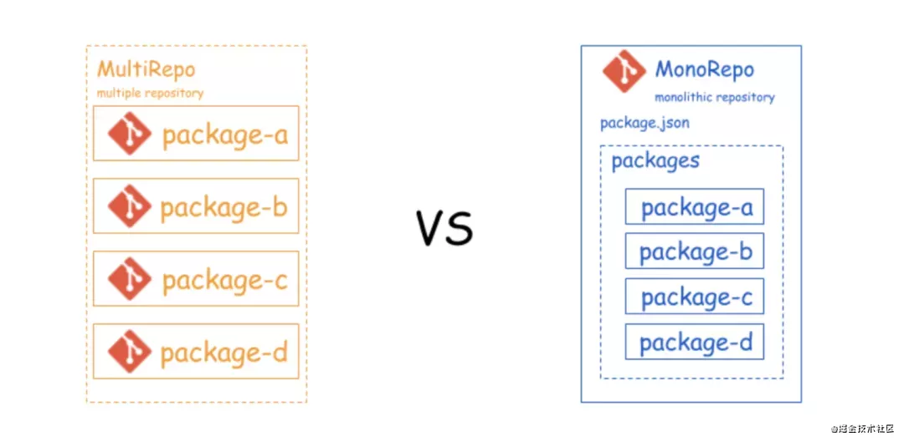
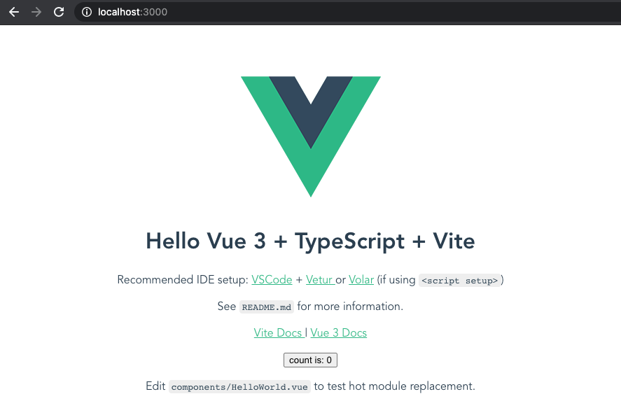
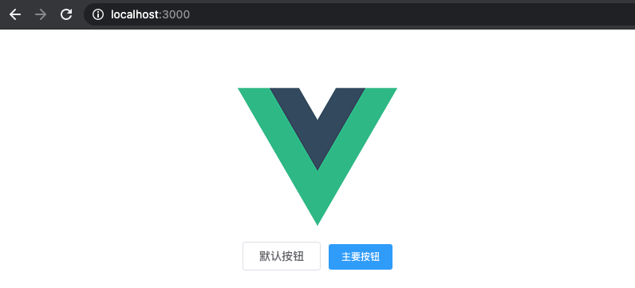

# 基于 Monorepo 的 Lerna 原理和实践

## 1. Lerna 介绍

`Lerna` 的名字来源于希腊神话中的`九头蛇海德拉(Lernaean Hydra)`，拿它形容多项目工程是再贴切不过了。


### 1.1 Lerna 基础概念

> A tool for managing JavaScript projects with multiple packages. Lerna is a tool that optimizes the workflow around managing multi-package repositories with git and npm.

翻译：`Lerna` 是一个用来优化托管在 `git + npm` 上的多 `package` 代码库的工作流的一个管理工具，可以让你在主项目下管理多个子项目，从而解决了多个包互相依赖，且发布时需要手动维护多个包的问题。

### 1.2 Lerna 解决了哪些痛点

- 资源浪费

  通常情况下，一个公司的业务项目只有一个主干，多 `git repo` 的方式，这样 `node_module` 会出现大量的冗余，比如它们可能都会安装 `React`、`React-dom` 等包，浪费了大量存储空间。

- 调试繁琐

  很多公共的包通过 `npm` 安装，想要调试依赖的包时，需要通过 `npm link` 的方式进行调试。

- 资源包升级问题

  一个项目依赖了多个 `npm` 包，当某一个子 `npm` 包代码修改升级时，都要对主干项目包进行升级修改。

### 1.3 应用场景

#### 1.3.1 业务项目公共逻辑封装

比如一个产品覆盖 `Web`、小程序两个平台，分别创建两个 `git` 项目，对应同一个后台服务，几个项目调用的 `API` 和页面处理逻辑大多一样。
这样就会导致两个项目出现一些重复逻辑。比如 `CGI` 逻辑封装，常量配置，接口数据处理等。

常规的做法呢，就是通过 `git submodule` 的方式，建一个公共 `git` 项目，两个 `git` 项目分别引入。虽然方便开发和调试，但不便于版本控制。
这个时候就可以引入 `Lerna`，两个项目和公共逻辑在一个 `git` 项目中，两个项目通过 `npm` 包的方式引入，也便于开发和调试。

目录结构如下：

```
.
lerna-repo
    ├── packages
    |    ├── common
    |    |    ├── ...
    |    |    └── package.json # 发布版本号，外部依赖
    |    ├── weapp
    |    |    ├── ...
    |    |    └── package.json # 依赖 common 版本
    |    └── h5
    |    |    ├── ...
    |    |    └── package.json # 依赖 common 版本
    ├── lerna.json
    └── package.json
```

#### 1.3.2 框架及插件统一管理

比如一个脚手架依赖多个插件，那么就可以对开源框架和支持插件在 `git` 项目中统一开发和版本管理。

目录结构如下：

```
.
lerna-repo
  ├── packages
  |    ├── lerna-repo # 脚手架单独包管理
  |    |    ├── ...
  |    |    └── package.json
  |    ├── plugin-one # 支持插件单独包管理
  |    |    ├── ...
  |    |    └── package.json
  |    └── plugin-two # 支持插件单独包管理
  |    |    ├── ...
  |    |    └── package.json
  ├── lerna.json
  └── package.json
```

> 事实上，开源社区早已有很多项目使用了这种多项目合而为一的方案，且采用了 `Lerna` 框架的代码库也大多耳熟能详。
>
> 比如国外的有 [babel](https://gitee.com/mirrors/babel)、[create-react-app](https://gitee.com/mirrors/create-react-app)、[react-router](https://gitee.com/mirrors/react-router)、[jest](https://gitee.com/mirrors/jest)、以及国内的有 跨端小程序框架 [Taro](https://github.com/NervJS/taro)，[element-plus](https://gitee.com/element-plus/element-plus)等。

注：鉴于近期 `github` 访问受限，不方便访问的缘故，所以贴上 `gitee` 的地址。

#### 1.3.3 公共组件开发（无业务依赖）

比如企业内部的 `UI` 基础组件库，和业务项目完全解耦。这种情况就需要单独包管理。
常规做法呢，就是组件库单独一个 `git` 项目，发布打包即可。
但这样开发调试上就会不太方便。更改后，需要实际项目 `升级版本号后重新安装依赖` 或者执行 `npm link` 后才能看效果。

但引入 `Lerna` 后，基础组件库和实际的项目 `demo` 公用一个 `git` 项目即可，这样就提升了开发调试效率。

目录结构如下：

```
.
lerna-repo
  ├── packages
  |    ├── ui-component # UI组件库
  |    |    ├── ...
  |    |    └── package.json
  |    ├── preview # 组件体验项目
  |    |    ├── ...
  |    |    └── package.json # 依赖UI组件库版本号
  ├── lerna.json
  └── package.json
```

### 1.4 Lerna 弊端

由于公共逻辑和多个业务项目糅合在一起，所以会有以下弊端：

- 仓库变更就会比较频繁，容易误提交和改动；
- 基于 `Git Flow` 的 `CI/CD` 发布流程，需要对不同项目定制化处理；
- 不同项目下的开发权限不便做区分；

基于以上不足，团队考虑采用这个 `Lerna` 技术栈的时候，要做好适当的取舍处理。

### 1.5 MonoRepo 和 MultRepo 对比

> 基于 `Lerna` 的方式，即为 `MonoRepo`。

- `MonoRepo`: 是将所有的模块统一的放在一个主干分支之中管理。
- `MultRepo`: 将项目分化为多个模块，并针对每一个模块单独的开辟一个 `Reporsitory` 来进行管理。



## 2. Lerna 原理

在采用 `Lerna` 之前，我们测试依赖库的时候，一般使用 `npm link` 的方式。
所以在正式介绍 `Lerna` 原理之前，我们先了解下 `npm link` 相关的知识点。

### 2.1 npm link 使用及原理

> 由于 `npm link` 与 `yarn link` 使用方式相同，因此本文就只用 `npm link` 为例进行介绍。

开发的时候，一个包可以链接到另一个项目。
通常用于开发新功能，或者尝试调试包在其他项目中表现的问题时。

#### 2.1.1 npm link 的使用

我们在开发项目 `project` 时需要使用本地开发的另外一个包 `link-module` 时，我们该怎么做呢？

1. 初始化包文件：

```bash
cd link-module && npm init -y
```

```json
// link-module/package.json

{
    "name": "link-module",
    "version": "1.0.0",
    "main": "index.js",
    "license": "ISC"
}
```

```js
// link-module/index.js

module.exports = function () {
    console.log('link-module run here ...');
};
```

2. `cd` 进入 `link-module` 目录，执行 `npm link`:

```bash
cd link-module && npm link
# npm WARN link-module@1.0.0 No description
# npm WARN link-module@1.0.0 No repository field.

# up to date in 0.399s
# [~User]/.nvm/versions/node/v13.7.0/lib/node_modules/link-module -> [npm-link-demo]/link-module
```

3. `cd` 进入 `npm-link-demo` 执行 `npm link link-module`:

```bash
cd npm-link-demo && npm link link-module
# [npm-link-demo]/project/node_modules/link-module -> [~User]/.nvm/versions/node/v13.7.0/lib/node_modules/link-module -> [npm-link-demo]/link-module
```

4. 初始化 `project` 文件

```js
// project/index.js

const linkModule = require('link-module');
console.log(linkModule());
```

5. 执行看下效果：

```bash
node index.js
# link-module run here ...
```

以上 `demo` 目录结构为：


此时我们在 `link-module` 包做任何修改，都可以及时的反应到 `project` 中。

不想使用 `link-module` 时可以分别执行 `npm link` 和 `npm unlink link-module` 解除连接：

```bash
cd link-module && npm unlink
# removed 1 package in 0.025s

cd project && npm unlink link-module
# npm WARN project@ No description
# npm WARN project@ No repository field.
# npm WARN project@ No license field.

# removed 1 package in 0.228s
```

#### 2.1.2 npm link 的原理

`link` 的本质就是软链接，这样可以让我们快速使用本地正在开发的其它包。

1. 执行 `cd link-module && npm link` 后，相当于把本地包映射到 `公共包管理路径`。
2. 因此我们在 project 中执行 `cd project && npm link link-module` 命令时，它就会去 `公共包管理路径` 这个路径下寻找是否有这个包，如果有就建立软链。

### 2.2 Lerna 软链实现

> `Lerna` 中也是通过类似 `npm link` 建立软链的方式来实现进行模块的引入和调试。

下面看下 `Node.js` 中如何实现软链的。

```js
fs.symlinkSync(target, path, [type]);
```

| 参数 | 类型 | 说明 |
| --- | --- | --- |
| target | `string`、`Buffer`、`URL` | 为源目录或文件的路径 |
| path | `string` | `Buffer` | `URL` | 它是存放转换后的目录的路径，默认为当前工作目录 |
| type | `string` | 默认值: `file`，可选值 `dir`、`file`，或者 `junction`，该项仅用于 `Windows`（在其他平台上忽略）。 |

它会创建名为 `path` 的软链接，该链接指向 `target`。

> `type` 参数仅在 `Windows` 上可用，在其他平台上则会被忽略。它可以被设置为 `dir`、 `file` 或 `junction`。
> 如果未设置 `type` 参数，则 `Node.js` 将会自动检测 `target` 的类型并使用 `file` 或 `dir`。
> 如果 `target` 不存在，则将会使用 `file`。
> `Windows` 上的连接点要求目标路径是绝对路径。当使用 `junction` 时, `target` 参数将会自动地标准化为绝对路径。

基本使用：

```js
const fs = require('node:fs');

try {
    fs.symlinkSync('./src/a.js', './b.js');
    console.log('创建软链成功');
}
catch (err) {
    console.error('创建软链失败 | err:', err);
}
```

这段代码的意思是为：创建一个软链接 `b.js` 指向了文件 `./targert/a.js`，当 `a.js` 中的内容发生变化时，`b.js` 文件也会发生相同的改变。

`Lerna` 的[源码](https://github.com/lerna/lerna)中动态链接是通过 `symlink` 来实现的。这里截取部分源码展示：

```js
// utils/create-symlink/create-symlink.js

function createSymbolicLink(src, dest, type) {
    log.silly('createSymbolicLink', [src, dest, type]);

    return fs
        .lstat(dest)
        .then(() => fs.unlink(dest))
        .catch(() => {
            /* nothing exists at destination */
        })
        .then(() => fs.symlink(src, dest, type));
}
```

## 3. Lerna 基本使用

### 3.1 Lerna 环境配置

`Lerna` 在使用之前需要全局安装 `lerna` 工具：

```bash
npm install lerna -g
```

### 3.2 Lerna 常用命令

> 这里仅留作记录和备份，需要的时候可以找下。

#### 3.2.1 初始化 lerna 项目

> 需要先 `cd` 到项目目录下再执行。

```bash
lerna init
```

举个例子 🌰：

```bash
mkdir lerno-demo && lerno init
```

然后一个基础的 lerno 项目就初始化好了。

```
.
lerna-demo
  ├── packages # 工程目录，初始为空目录
  ├── lerna.json # lerna配置文件
  └── package.json # 工程配置文件
```

然后我们看下初始化文件内容：

```json
// package.json

{
    "name": "root",
    "private": true,
    "devDependencies": {
        "lerna": "^4.0.0"
    }
}
```

> 这里，`package.json` 中有一点需要注意，他的 `private` 必须设置为 `true`。
> 因为 `mono-repo` 本身的这个 `Git` 仓库并不是一个项目，他是多个项目，所以不能进行直接发布。
> 发布的应该是 `packages/` 下面的各个子项目。

```json
// lerna.json

{
    "packages": ["packages/*"],
    "version": "0.0.0"
}
```

#### 3.2.2 引入本地项目或者包

```bash
lerna import [本地的项目路径]
```

每个被导入的项目都会被存放在根路径的 `packages` 目录下。
而且在导入的同时，每个项目的 `git` 提交记录也都合并在了一起。

这里就不做举例说明了。本地项目需要满足以下条件：

- 需要是一个 `git` 项目；
- 需要有 `package.json` 文件；
- 当前 `lerna` 项目 也是一个 `git` 项目，且本地文件都已提交。

#### 3.2.3 创建一个新的由 lerna 管理的包

```bash
lerna create [name]
```

举个例子 🌰：

```bash
cd lerna-demo && lerna create package-a
```

我们发现 `packages` 目录下自动生成一个 `package-a` 目录：

```
.
packages
    ├── package-a
    |    |    └── package-a.test.js
    |    ├── lib
    |    |    └── package-a.js
    |    ├── package.json
    |    └── README.md
```

```js
// lib/package-a.js

'use strict';

module.exports = packageA;

function packageA() {
    //
}
```

```json
// package.json
{
    "name": "package-a",
    "version": "0.0.0",
    "description": "",
    "license": "ISC",
    "main": "lib/package-a.js",
    "directories": {
        "lib": "lib",
        "test": "__tests__"
    },
    "files": ["lib"],
    "publishConfig": {
        "registry": "https://registry.npm.taobao.org"
    },
    "repository": {},
    "scripts": {
        "test": "echo \"Error: run tests from root\" && exit 1"
    }
}
```

```js
// ___test___/package-a.test.js

'use strict';

const packageA = require('..');

describe('package-a', () => {
    it('needs tests');
});
```

> 其中 `require('..')` 指向 `lib/package-a.js`，由 `package.json` 中 `main` 字段指定。

#### 3.2.4 增加模块包到最外层的公共 `node_modules` 中

```bash
lerna add [name]
```

举个例子 🌰：

```bash
cd lerna-demo && lerna add axios
# lerna notice cli v4.0.0
# lerna info Adding axios in 1 package
# lerna info bootstrap root only
# yarn install v1.23.0-20200205.1242
# [1/4] 🔍  Resolving packages...
# [2/4] 🚚  Fetching packages...
# [3/4] 🔗  Linking dependencies...
# [4/4] 🔨  Building fresh packages...
# success Saved lockfile.
# ✨  Done in 10.77s.
```

然后我们发现 `packages` 目录下所有项目的 `package.json` 文件都有更新：

```json
// package-a/package.json

{
    // ...

    "dependencies": {
        "axios": "^0.21.1"
    }

    // ...
}
```

但包安装到了最外层的 `node_modules` 目录下面。

#### 3.2.5 增加模块包到 `packages` 中指定项目

也可描述为管理项目依赖。

> 下面是将 `ui-web` 模块增加到 `example-web` 项目中：

```bash
lerna add ui-web --scope=example-web
```

举个例子 🌰：

```bash
lerna add lodash --scope=package-a
# lerna notice cli v4.0.0
# lerna notice filter including "package-a"
# lerna info filter [ 'package-a' ]
# lerna info Adding lodash in 1 package
# lerna info bootstrap root only
# yarn install v1.23.0-20200205.1242
# [1/4] 🔍  Resolving packages...
# [2/4] 🚚  Fetching packages...
# [3/4] 🔗  Linking dependencies...
# [4/4] 🔨  Building fresh packages...
# success Saved lockfile.
# ✨  Done in 1.60s.
```

然后我们发现 `packages` 目录下只有 `package-a` 项目的 `package.json` 文件都有更新：

```json
// package-a/package.json

{
    // ...

    "dependencies": {
        "axios": "^0.21.1",
        "lodash": "^4.17.21"
    }

    // ...
}
```

但包也是安装在最外层的 `node_modules` 目录下面。

#### 3.2.6 安装所有依赖项并连接所有的交叉依赖

> 根据实际操作结果，`lerna bootstrop`、`lerna bootstrop --hoist` 和 `yarn install`，安装包都是在最外层的 `node_modules`下面。
> 只是 `yarn install` 的方式，对包多版本的安装有兼容。
> 所以，实际的操作中，用 `yarn install` 即可，lerna 自带的安装不予考虑。
> yarn 具体配置方式详见 `和 Yarn 搭配使用` 章节。

```bash
lerna bootstrap
```

`Lerna` 可以通过 `lerna bootstrap` 一行命令安装所有子项目的依赖包。

如果子项目中已经独立安装了依赖包，在子项目的`node_modules`下面，想自动把公共依赖包提升到顶层的 `node_modules` 目录下面，如何处理呢？

`Lerna` 也提供了可以将子项目的依赖包提升到最顶层的方式。
我们可以执行 `lerna clean` 先删除每个子项目的 `node_modules`，然后执行命令 `lerna bootstrop --hoist`即可。
`lerna bootstrop --hoist` 会将 `packages` 目录下的`公共模块包`抽离到`最顶层`。

但是 `lerna bootstrop --hoist` 这种方式会有一个问题：
不同版本号只会保留使用最多的版本，这种配置不太好，当项目中有些功能需要依赖老版本时，就会出现问题。

#### 3.2.7 在 packages 中对应包下的执行任意命令

> 下面的命令，是对 `packages` 下的 `example-web` 项目执行 `yarn start` 命令，可以把它配置到最外层的 package.json 中。

```bash
lerna exec --scope example-web -- yarn start
```

如果命令中不增加 `--scope example-web` 直接使用下面的命令，这会在 `packages` 下所有包执行命令 `rm -rf ./node_modules`：

```bash
lerna exec -- rm -rf ./node_modules
```

举个例子 🌰：

```bash
lerna exec --scope package-a -- yarn start
# info cli using local version of lerna
# lerna notice cli v4.0.0
# lerna notice filter including "package-a"
# lerna info filter [ 'package-a' ]
# lerna info Executing command in 1 package: "yarn start"
# yarn run v1.23.0-20200205.1242
# $ echo start && exit 0
# start
# ✨  Done in 0.04s.
# lerna success exec Executed command in 1 package: "yarn start"
```

#### 3.2.8 显示所有的安装的包

```bash
lerna list # 等同于 lerna ls
```

也可以通过 `json` 的方式查看 `lerna` 安装了哪些包，`json` 中还包括包的路径，有时候可以用于查找包是否生效。

```bash
lerna list --json
```

举个例子 🌰：

```bash
lerna list
# info cli using local version of lerna
# lerna notice cli v4.0.0
# package-a
# lerna success found 1 packages
```

```bash
lerna list --json
# info cli using local version of lerna
# lerna notice cli v4.0.0
# [
#   {
#     "name": "package-a",
#     "version": "0.0.0",
#     "private": false,
#     "location": "[lerna-demo]/packages/package-a"
#   }
# ]
# lerna success found 1 packages
```

#### 3.2.9 从所有包中删除 `node_modules` 目录

> 注： `lerna clean` 不会删除项目最外层的根 `node_modules`。

```bash
lerna clean
```

举个例子 🌰：

```bash
lerna clean
# info cli using local version of lerna
# lerna notice cli v4.0.0
# lerna info Removing the following directories:
# lerna info clean packages/package-a/node_modules
# ? Proceed? Yes
# [lerna-demo]/packages/package-a/node_modules
# lerna success clean finished
```

#### 3.2.10 在当前项目中发布包

```bash
lerna publish
```

这个命令可以结合 `lerna.json` 中的 `"version": "independent"` 配置一起使用：
既可以管理发布版本号，也可以管理 `packages` 下单个包的版本号。

> `lerna publish` 永远不会发布标记为 `private` 的包（`package.json` 中的 `"private": true` ）。

举个例子 🌰：

```bash
lerna publish
# info cli using local version of lerna
# lerna notice cli v4.0.0
# lerna info current version 0.0.0
# lerna info Assuming all packages changed
# ? Select a new version (currently 0.0.0) Patch (0.0.1)

# Changes:
#  - package-a: 0.0.0 => 0.0.1

# ? Are you sure you want to publish these packages? Yes
# lerna info execute Skipping releases
# lerna info git Pushing tags...
# lerna info publish Publishing packages to npm...
# lerna notice Skipping all user and access validation due to third-party registry
# lerna notice Make sure you're authenticated properly ¯\_(ツ)_/¯
# lerna WARN ENOLICENSE Packages package-a are missing a license.
# lerna WARN ENOLICENSE One way to fix this is to add a LICENSE.md file to the root of this repository.
# lerna WARN ENOLICENSE See https://choosealicense.com for additional guidance.
# lerna http fetch PUT 401 https://registry.npm.taobao.org/package-a 172ms
# lerna ERR! E401 [unauthorized] Login first
```

我们发现，增加一个 git 提交记录，备注为 `v0.0.1`，也增加了一个标签，标签名为 `v0.0.1`。
因为 npm 没有登录，所以提示无权限，没有发布成功。

### 3.4 和 Yarn 搭配使用

> 前面介绍过，`lerna bootstrop --hoist` 会将 `packages` 目录下的公共模块包抽离到最顶层，但是这种方式会有一个问题，不同版本号只会保留使用最多的版本，这种配置不太好，当项目中有些功能需要依赖老版本时，就会出现问题。

有没有更优雅的方式呢？

再介绍一个命令 `yarn workspaces` ，可以解决前面说的当不同的项目依赖不同的版本号问题，`yarn workspaces` 会检查每个子项目里面依赖及其版本，如果版本不一致都会保留到自己的 `node_modules` 中，只有依赖版本号一致的时候才会提升到顶层。

注意：这种需要在 lerna.json 中增加配置：

```json
{
    // ...

    "npmClient": "yarn", // 指定 npmClent 为 yarn
    "useWorkspaces": true // 将 useWorkspaces 设置为 true

    // ...
}
```

并且在顶层的 package.json 中增加配置：

```json
{
    // ...

    "workspaces": ["packages/*"]

    // ...
}
```

增加了这个配置后，不需要再用 `lerna bootstrap` 来安装依赖了，可以直接使用 `yarn install` 进行依赖的安装。
注意：`yarn install` 无论在顶层运行还是在任意一个子项目运行都可以，安装包都会在顶层的 `node_modules` 目录下。

### 3.5 启动子项目

可以利用 `lerna exec` 命令，实现启动子项目的效果。

举个例子 🌰：

在顶层的 package.json 文件中进行配置，在 scripts 中增加配置：

```json
// package.json

{
    // ...

    "scripts": {
        "start-a": "lerna exec --scope package-a -- yarn start"
    }

    // ...
}
```

```bash
yarn start-a
# yarn run v1.23.0-20200205.1242
lerna exec --scope package-a -- yarn start
# lerna notice cli v4.0.0
# lerna notice filter including "package-a"
# lerna info filter [ 'package-a' ]
# lerna info Executing command in 1 package: "yarn start"
echo start && exit 0
# start
# lerna success exec Executed command in 1 package: "yarn start"
# ✨  Done in 1.27s.
```

### 3.6 引用本地库

这里直接举例 🌰 说明。

```bash
cd lerna-demo/packages && mkdir package-b && npm init -y
lerna add package-a --scope=package-b
```

我们发现虽然 `package-a` 没有发布到 npm，但是可以正常安装。
安装后，`packages/package-b/package.json` 文件更新内容如下：

```json
// package-b/package.json

{
    // ...

    "dependencies": {
        "package-a": "^0.0.1"
    }

    // ...
}
```

我们看下最外层的`node_modules/package-a`目录，发现已经软链到 `packages/package-a` 目录了。

然后我们用几行代码测试验证下。

`packages/package-b/index.js`文件内容如下：

```js
// packages/package-b/index.js

const packageA = require('package-a');
packageA();
```

执行结果如下：

```bash
node packages/package-b/index.js
# packageA run here ...
```

说明引用本地库实现所见即所得了。

## 4. Lerna 实例

我们这里以公共 UI 组件库为例。

> 公共组件库有单个组件版本发布和集中式组件版本发布两种，为了方便说明，我们这里以集中式组件版本发布为例。

为了便于实现效果，所以公共组件库和测试项目，均为 `Vite + Vue3 + Ts` 项目。

`Vite` 官网[详见这里](https://www.vitejs.net/)。

1. 初始化项目目录

```bash
mkdir ui-componet && lerna init
```

2. 初始化 `Vite` 环境

因为 `Vite` 需要 `Node.js` 版本 `>= 12.0.0`, 所以我们需要设置本地 `node` 为 `12.0.0` 版本及以上。

```bash
nvm install v12.0.0 && nvm alias default v12.0.0
```

3. 初始化 `Vite` 项目

```bash
cd ui-componet/packages
npm init @vitejs/app ui-component --template vue-ts
npm init @vitejs/app examples --template vue-ts
```

4. 安装项目依赖

```bash
cd ui-component && yarn install
```

5. 跑下项目看看

```bash
cd ui-component/packages/ui-component && yarn dev
cd ui-component/packages/examples && yarn dev
```

初始化运行效果如下：



说明开发环境已经 OK 了。下面就可以进行积木式实现了。

6. `ui-component` 开发

```json
// ui-component/package.json

{
    // ...
    "main": "src/index.ts"
    // ...
}
```

```ts
// ui-component/src/index.ts

import { App } from 'vue';
import Button from './components/button/index';

const install = function (app: App) {
    components.forEach((component) => {
        app.component(component.name, component);
    });
};

const components = [Button];

export default {
    install,
    Button,
};
```

```ts
// ui-component/src/components/button/index.ts

import type { SFCWithInstall } from '../utils/types';
import { App } from 'vue';
import Button from './src/button.vue';

Button.install = (app: App): void => {
    app.component(Button.name, Button);
};

const _Button: SFCWithInstall<typeof Button> = Button;

export default _Button;
```

```vue
<!-- ui-component/src/components/button/src/button.ts -->

<template>
    <button
        class="el-button" :class="[type ? `el-button--${type}` : '', buttonSize ? `el-button--${buttonSize}` : '']"
        @click="handleClick"
    >
        <span v-if="$slots.default"><slot /></span>
    </button>
</template>

<script lang="ts">
import type { PropType } from 'vue';
import { computed, defineComponent } from 'vue';

import { isValidComponentSize } from '../../utils/validators';

type IButtonType = PropType<'primary' | 'default'>;

type EmitFn = (evt: Event) => void;

export default defineComponent({
    name: 'TestButton',

    props: {
        type: {
            type: String as IButtonType,
            default: 'default',
            validator: (val: string) => {
                return ['default', 'primary'].includes(val);
            },
        },
        size: {
            type: String as PropType<ComponentSize>,
            validator: isValidComponentSize,
        },
    },

    emits: ['click'],

    setup(props: any, { emit }) {
        const buttonSize = computed(() => {
            return props.size || 'medium';
        });

        // methods
        const handleClick: EmitFn = (evt: MouseEvent) => {
            emit('click', evt);
        };

        return {
            buttonSize,
            handleClick,
        };
    },
});
</script>

<style>
.el-button {
  display: inline-block;

  white-space: nowrap;
  cursor: pointer;
  -webkit-appearance: none;
  outline: 0;
  margin: 0;

  text-align: center;
  box-sizing: border-box;
  transition: 0.1s;

  background: #fff;
  border: 1px solid #dcdfe6;
  color: #606266;

  font-weight: 500;
  line-height: 1;
}
.el-button + .el-button {
  margin-left: 10px;
}

.el-button:focus,
.el-button:hover {
  color: #409eff;
  border-color: #c6e2ff;
  background-color: #ecf5ff;
}
.el-button:active {
  color: #3a8ee6;
  border-color: #3a8ee6;
  outline: 0;
}

.el-button--primary {
  color: #fff;
  background-color: #409eff;
  border-color: #409eff;
}
.el-button--primary:focus,
.el-button--primary:hover {
  background: #66b1ff;
  border-color: #66b1ff;
  color: #fff;
}
.el-button--primary:active {
  background: #3a8ee6;
  border-color: #3a8ee6;
  color: #fff;
}
.el-button--primary:active {
  outline: 0;
}

.el-button--medium {
  padding: 10px 20px;
  font-size: 14px;
  border-radius: 4px;
}
.el-button--small {
  font-size: 12px;
  border-radius: 3px;
  padding: 9px 15px;
}
</style>
```

7. 实际项目引入

```bash
lerna add ui-component --scope=examples
```

```js
// examples/src/main.ts

import UIComponent from 'ui-component';
import { createApp } from 'vue';

import App from './App.vue';

const app = createApp(App);

app.use(UIComponent);

app.mount('#app');
```

```vue
<!-- examples/src/App.vue -->

<template>
    
    <div>
        <test-button>默认按钮</test-button>
        <test-button type="primary" size="small">
            主要按钮
        </test-button>
    </div>
</template>

<script lang="ts">
import { defineComponent } from 'vue';

export default defineComponent({
    name: 'App',
    components: {},
});
</script>

<style>
#app {
  font-family: Avenir, Helvetica, Arial, sans-serif;
  -webkit-font-smoothing: antialiased;
  -moz-osx-font-smoothing: grayscale;
  text-align: center;
  color: #2c3e50;
  margin-top: 60px;
}
</style>
```

8. 运行看看

```json
// 最外层 package.json

{
    // ...

    "scripts": {
        "preview": "lerna exec --scope examples -- yarn dev"
    }

    // ...
}
```

```bash
yarn preview
```

效果如下：



## 5. 参考

- [现代前端工程化-彻底搞懂基于 Monorepo 的 lerna 模块(从原理到实战)](https://mp.weixin.qq.com/s/Qf65Pk0t1n0L1s7Fv-XZew)
- [大前端项目代码重用，也许 lerna 是最好的选择](https://segmentfault.com/a/1190000023160081)
