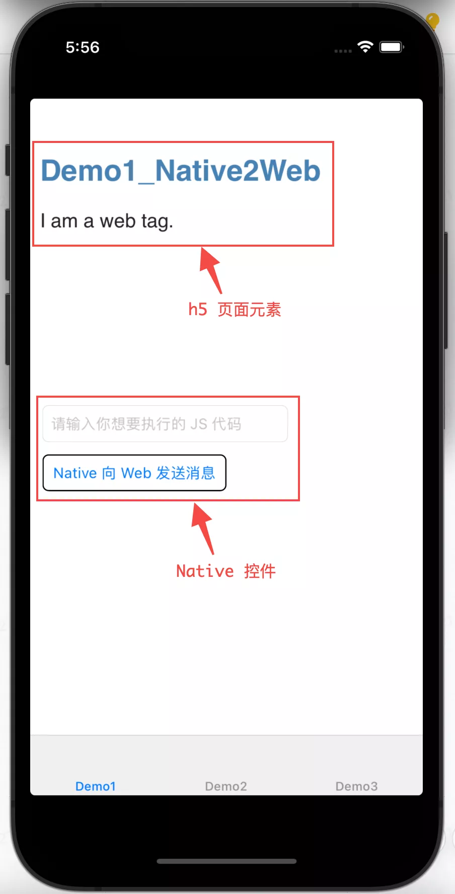
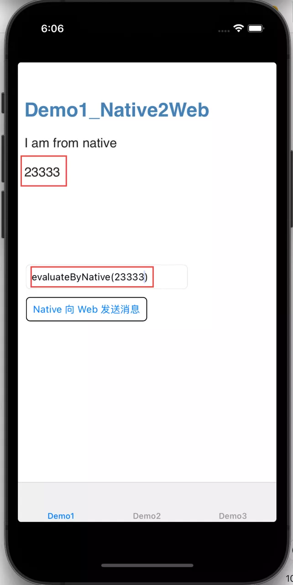
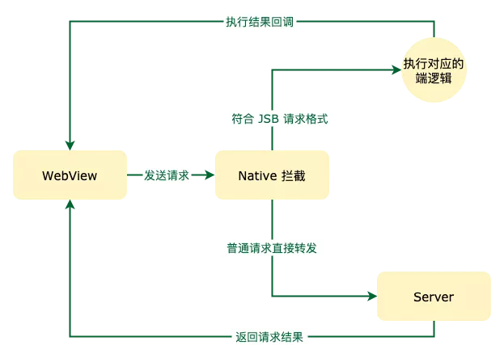
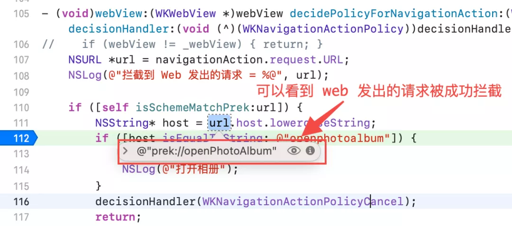
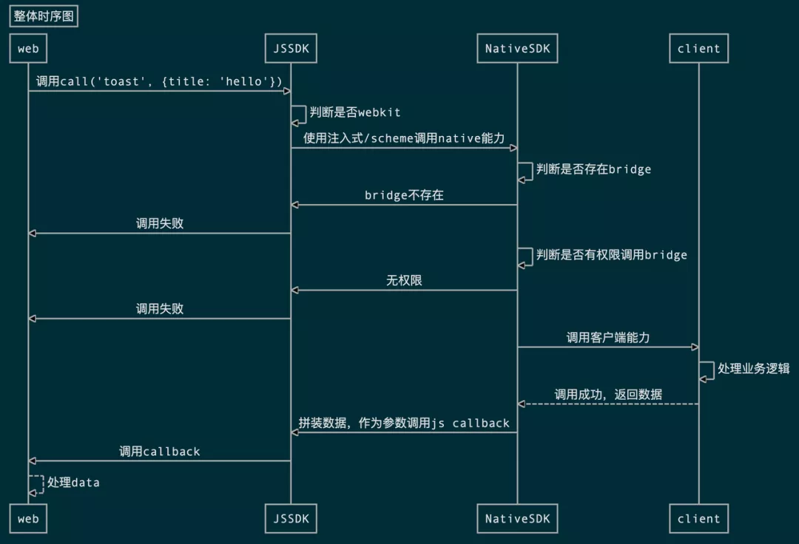

# 浅谈 JSBridge 原理与实践

## 1. 基本介绍

### 1.1 什么是 JSB

我们开发的 `h5` 页面运行在终端上的 `WebView` 容器之中，很多业务场景下 `h5` 需要依赖端上提供的信息/能力，这时我们需要一个可以连接原生运行环境和 `JS` 运行环境的桥梁。

这个桥梁就是 `JSB`，「JSB」「让 `Web` 端和 `Native` 端得以实现双向通信」。


### 1.2 WebView 概述

`WebView` 是移动端中的一个控件，它为 `JS` 运行提供了一个沙箱环境。
`WebView` 能够加载指定的 `url`，拦截页面发出的各种请求等页面控制功能，`JSB` 的实现就依赖于 `WebView` 暴露的各种接口。

由于历史原因，`安卓`和 `iOS` 均有高低两套版本的 `WebView` 内核：

| 「平台和版本」 | 「WebView」「内核」 |
| -------------- | ------------------- |
| iOS 8+         | WKWebView           |
| iOS 2-8        | UIWebView           |
| Android 4.4+   | Chrome              |
| Android 4.4-   | Webkit              |

> PS: 下文中出现的高版本均代指 `iOS 8+` 或 `Android 4.4+`，低版本则相反。

### 1.3 JSB 原理

要实现双向通信自然要依次实现 `Native` 向 `Web` 发送消息和 `Web` 向 `Native` 发送消息。

## 2. Native 向 Web 发送消息

`Native` 向 `Web` 发送消息基本原理上是在 `WebView` 容器中动态地执行一段 `JS` 脚本，通常情况下是调用一个挂载在全局上下文的方法。

`Android` 和 `iOS` 均提供了不同的接口来实现这一过程。

### 2.1 方法

- `Android` 高低版本存在两种直接执行 `JS` 字符串的方法：

  | 「Android 版本」 | 「API」 「特点」                                        |
  | ---------------- | ------------------------------------------------------- |
  | 低版本           | WebView.loadUrl 无法执行回调                            |
  | 高版本           | WebView.evaluateJavascript 可以拿到 JS 执行完毕的返回值 |

- `iOS` 高低版本同样存在两种不同的实现方式：

  | 「iOS 版本」 | 「API」 「特点」                                              |
  | ------------ | ------------------------------------------------------------- |
  | 低版本       | UIWebView.stringByEvaluatingJavaScriptFromString 无法执行回调 |
  | 高版本       | WKWebView.evaluateJavaScript 可以拿到 JS 执行完毕的返回值     |

### 2.2 实践

> 「本文所有 `Demo` 均运行在 `iOS14.5` 模拟器中，`WebView` 容器采用 `WKWebView` 内核」。

下面我们通过一个小 `Demo` 来看一下在 `iOS` 端实现 `Native` 向 `Web` 端发消息的实际效果：



页面上半部分的 `UI` 是由 `HTML + CSS` 渲染所得，是一个纯静态的 `webpage`，中间的输入框和按钮是 `Native` 原生控件，直接覆盖在 `WebView` 容器之上。

「在 `Native` 按钮上绑定了一个点击事件：将文本框输入的字符视为 `JS` 字符串并调用相关 `API` 直接执行」。

可以看到当我们在文本框中输入下列字符并点击按钮后，`h5` 页面中 `id` 为 `test` 的 `p` 标签内容被修改了：

```js
document.querySelector('#test').innerHTML = 'I am from native';
```


敏锐的同学到这一步其实就已经知道我们在日常使用 JSB 时客户端是如何调用前端 JS 代码了，我们在刚刚的静态 html 文件中添加几行 JS 代码：

```js
function evaluateByNative(params) {
    const p = document.createElement('p');
    // eslint-disable-next-line unicorn/prefer-dom-node-text-content
    p.innerText = params;
    document.body.appendChild(p);
    return 'Hello Bridge!';
}
```

在文本框中输入 `evaluateByNative(23333)`，来看一下调用的结果：



可以看到 「`Native` 端可以直接调用挂载在 `window` 上的全局方法并传入相应的函数执行参数」，「并且在函数执行结束后 `Native` 端可以直接拿到执行成功的返回值。」

## 3. Web 向 Native 发送消息

`Web` 向 `Native` 发送消息本质上就是某段 `JS` 代码的执行端上是可感知的，目前业界主流的实现方案有两种，分别是「拦截式」和「注入式」。

### 3.1 拦截式

#### 3.1.1 介绍

和浏览器类似， `WebView` 中发出的所有请求都是可以被 `Native` 容器感知到的。
因此拦截式具体指的是 `Native` 拦截 `Web` 发出的 `URL` 请求。
双方在此之前约定一个 `JSB` 请求格式，如果该请求是 `JSB` 则进行相应的处理，若不是则直接转发。

「`Native` 拦截请求的钩子方法：」

| 「平台」 | 「API」                         |
| -------- | ------------------------------- |
| Android  | shouldOverrideUrlLoading        |
| iOS 8+   | decidePolicyForNavigationAction |
| iOS 8-   | shouldStartLoadWithRequest      |

「拦截式的基本流程如下」：



上述流程存在几个问题：

- 「通过何种方式发出请求？」

Web 端发出请求的方式非常多样，例如 `<a/>` 、`iframe.src`、`location.href`、`ajax` 等，但 `<a/>` 需要用户手动触发，`location.href` 可能会导致页面跳转，安卓端拦截 `ajax` 的能力有所欠缺。
因此「绝大多数拦截式实现方案均采用」`iframe` 「来发送请求」。

- 「如何规定」 「JSB」 「的请求格式？」

一个标准的 URL 由 `<scheme>://<host>:<port><path>` 组成。

相信大家都有过从微信或手机浏览器点击某个链接意外跳转到其他 `App` 的经历，如果有仔细留意过这些链接的 `URL` 你会发现目前主流 `App` 都有其专属的一个 `scheme` 来作为该应用的标识，例如微信的 `URL scheme` 就是 `weixin://`。

「JSB」 「的实现借鉴这一思路，定制业务自身专属的一个 `URL scheme` 来作为 `JSB` 请求的标识」，例如字节内部实现拦截式 `JSB` 的 `SDK` 中就定义了 `bytedance://` 这样一个 scheme。

```js
// Web 通过动态创建 iframe，将 src 设置为符合双端规范的 url scheme
const CUSTOM_PROTOCOL_SCHEME = 'prek';

function web2Native(event) {
    const messagingIframe = document.createElement('iframe');
    messagingIframe.style.display = 'none';
    messagingIframe.src = `${CUSTOM_PROTOCOL_SCHEME}://${event}`;
    document.documentElement.appendChild(messagingIframe);

    setTimeout(() => {
        document.documentElement.removeChild(messagingIframe);
    }, 200);
}
```

拦截式在双端都具有非常好的向下兼容性，曾经是最主流的 `JSB` 实现方案，但目前在高版本的系统中已经逐渐被淘汰，理由是它有如下几个劣势：

- 连续发送时可能会造成消息丢失（可以使用消息队列解决该问题）
- `URL` 字符串长度有限制
- 性能一般，`URL request` 创建请求有一定的耗时（`Android 端 200-400ms`）

#### 3.1.2 「实践案例」

同样用一个简单的 `Demo2` 来看一下如何使用拦截式实现 `Web` 向 `Native` 发送消息，这里实现了在 `Web` 端唤起 `Native` 的相册。


遵循上述实现方式，`Web` 发送消息的代码如下：

```js
const CUSTOM_PROTOCOL_SCHEME = 'prek'; // 自定义 url scheme

function web2Native(event_name) {
    const messagingIframe = document.createElement('iframe');
    messagingIframe.style.display = 'none';
    messagingIframe.src = `${CUSTOM_PROTOCOL_SCHEME}://${event_name}`;
    document.documentElement.appendChild(messagingIframe);
    setTimeout(() => {
        document.documentElement.removeChild(messagingIframe);
    }, 0);
}

const btn = document.querySelector('#btn');

btn.onclick = () => {
    web2Native('openPhotoAlbum');
};
```

`Native` 侧通过 `decidePolicyForNavigationAction` 这一 `delegate` 实现请求拦截，解析 `URL` 参数，若 `URL scheme` 是 `prek` 则认为该请求是一个来自 `Web` 的 `JSB` 调用：

```swift
- (void)webView:(WKWebView *)webView decidePolicyForNavigationAction:(WKNavigationAction *)navigationAction decisionHandler:(void (^)(WKNavigationActionPolicy))decisionHandler {
  NSURL *url = navigationAction.request.URL;
  NSLog(@"拦截到 Web 发出的请求 = %@", url);

  if ([self isSchemeMatchPrek:url]) {
    NSString* host = url.host.lowercaseString;
    if ([host isEqualToString: @"openphotoalbum"]) {
      [self openCameraForWeb]; // 打开相册
      NSLog(@"打开相册");
    }
    decisionHandler(WKNavigationActionPolicyCancel);
    return;
  } else {
    decisionHandler(WKNavigationActionPolicyAllow);
  }
}
```

为了更清晰地看到 `Native` 拦截的结果，在上述代理方法中打个断点：



继续执行，Congratulation！模拟器的相册被打开了！


### 3.2 注入式

注入式的原理是通过 `WebView` 提供的接口向 `JS` 全局上下文对象（`window`）中注入对象或者方法，当 `JS` 调用时，可直接执行相应的 `Native` 代码逻辑，从而达到 `Web` 调用 `Native` 的目的。

「`Native` 注入 `API` 的相关方法：」

| 「平台」 | 「API」                | 「特点」               |
| -------- | ---------------------- | ---------------------- |
| Android  | addJavascriptInterface | 4.2 版本以下有安全风险 |
| iOS 8+   | WKScriptMessageHandler | 无                     |
| iOS 7+   | JavaSciptCore 无       |

```swift
JSContext *context = [webView valueForKeyPath:@"documentView.webView.mainFrame.javaScriptContext"];

context[@"getAppInfo"] = ^(msg) {
    return @"ggl_2693";
};
```

```js
window.getAppInfo(); // 'ggl_2693'
```

这种方法简单而直观，并且不存在参数长度限制和性能瓶颈等问题，目前主流的 JSB SDK 都将注入式方案作为优先使用的对象。
注入式的实现非常简单，这里不做案例展示。

### 3.3 两种方案对比

为了更清晰地表达这两种方式的区别，这里贴一个对比表格：

| 「方案」 | 「兼容性」                  | 「性能」             | 「参数长度限制」 |
| -------- | --------------------------- | -------------------- | ---------------- |
| 拦截式   | 无兼容性问题                | 较差，安卓端尤为明显 | 有限制           |
| 注入式   | 安卓 4.2+ 和 iOS 7+以上可用 | 较好                 | 无               |

## 4. 如何执行回调

通过上述介绍我们已经知道如何实现双端互相发送消息，但上述两个通信过程缺少了“回应”这一动作，原因就是上述步骤缺少了回调函数的执行。

以拦截式为例，常见的一个 `JSB` 调用是 `Web` 获取当前 `App` 信息， `Native` 拦截到 `bytedance://getAppInfo` 这样一个请求后将获取当前 `App` 信息，那获取完成后如何让 `Web` 端拿到该信息呢？

一个最简单的做法是类比 `JSONP` 的实现，我们可以在请求的 URL 上拼接回调方法的事件名，将该事件挂载在全局 `window` 上，由于 `Native` 端可以轻松执行 `JS` 代码，因此在完成端逻辑后直接执行该事件名对应的回调方法即可。

以 `getAppInfo` 为例：

```js
// Web
let uniqueID = 1; // 为防止事件名冲突，给每个 callback 设置一个唯一标识
function webCallNative(event, params, callback) {
    if (typeof callback === 'Function') {
        const callbackID = `jsb_cb_${uniqueID++}_${Date.now()}`;
        window[callbackID] = callback;
    }
    const currentParams = { callback: callbackID };
    // 构造 url scheme
    const src = `bytedance://getAppInfo?${JSON.stringify(currentParams)}`;
    // ...
}
```

```swift
// Native

// 1. 解析传入的参数 'getAppInfo' 得知 Web 希望获取 AppInfo
// 2. 执行端逻辑获取 AppInfo
// 3. 执行参数中挂载在全局的 callback 方法，AppInfo 作为回调方法的参数
```

因此只要把相应的回调方法挂载在全局对象上，`Native` 即可把每次调用后的响应通过动态执行 `JS` 方法的形式传递到 `Web` 端，这样一来整个通信过程就实现了闭环。

## 5. 串联双端通信的过程

现在我们已经知道如何实现两端互相发送消息以及执行回调了，但看起来并不好用：

- 首先调用 `JSB` 时需要在方法名后拼接参数和对应的回调函数
- 其次回调函数还需要一个一个地挂载在全局对象上。

我们期望的使用方式其实是这样：

```js
// Web

web.call('event1', { param1 }, (res) => { /* ... */ }); // 触发 native event1 执行
web.on('event2', (res) => { /* ... */ });
```

```js
// Native

// 这里用 js 代替，理解大致意思即可
native.call('event2', { param2 }, (res) => { /* ... */ }); // 触发 web event2 执行
native.on('event1', (res) => { /* ... */ });
```

这里的 「`JSB` 就像是一个跨越两端的 `EventEmitter`」，因此需要 `Web` 和 `Native` 遵循同一套调度机制。


上图给出了 `Web 调用 -> Native 监听`的执行过程，同理 `Native 调用 -> Web 监听`也是同样的逻辑，只是把两边的实现调换一种语言，这里不赘述了。



## 6. 参考

- [字节面试题：什么是 JSBridge，原理与应用是什么？](https://mp.weixin.qq.com/s/ycejRGGP7OjfIxCcg5_7iw)
- [深入浅出 JSBridge：从原理到使用](https://juejin.cn/post/6936814903021797389#heading-8)
- [JSBridge 实战](https://juejin.cn/post/6844903702721986568)
