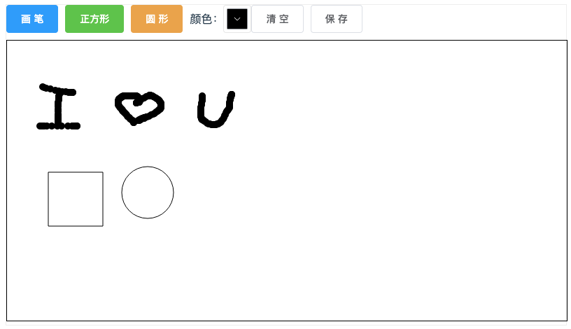

# canvas 实现画板和保存

## 1. 项目介绍

框架：使用 `Vite + Vue3 + ElementPlus`

关键点分析：

1. 鼠标拖拽画正方形和圆形
2. 画完一个保存画布，下次再画的时候叠加
3. 保存图片

第一点，只需要计算出鼠标点击的点坐标，以及鼠标的当前坐标，就可以计算出：
矩形长宽计算：`x - beginX, y - beginY`；
圆形则要利用勾股定理：`Math.sqrt((x - beginX) _ (x - beginX) + (y - beginY) _ (y - beginY))`；

第二点，则要利用 `canvas` 的 `getImageData` 和 `putImageData` 方法；

第三点，思路是将 `canvas` 生成图片链接，并赋值给具有下载功能的 `a` 标签，并主动点击 `a` 标签进行图片下载；

## 2. 具体实现

### 2.1 项目初始化

```bash
npm init vite@latest draw # 通过 vite 脚手架 初始化项目，选择 vue3+ts 模板
npm install # 安装依赖
npm run dev # 测试项目是否初始化 OK
npm install -D sass # 支持 scss
npm install element-plus --save # 安装 element-plus ui组件库
```

`ElementPlus` `Volar` 支持：

```json
// tsconfig.json
{
    "compilerOptions": {
    // ...
        "types": ["element-plus/global"]
    }
}
```

按需导入 `ElementPlus`：

```bash
npm install unplugin-vue-components
```

```js
import { ElementPlusResolver } from 'unplugin-vue-components/resolvers';
// vite.config.ts
import Components from 'unplugin-vue-components/vite';

export default {
    plugins: [
    // ...
        Components({
            resolvers: [ElementPlusResolver()],
        }),
    ],
};
```

### 2.2 实现效果



### 2.3 代码

```html
<template>
  <div class="wrapper">
    <div style="margin-bottom: 10px; display: flex; align-items: center">
      <el-button @click="changeType('huabi')" type="primary">画笔</el-button>
      <el-button @click="changeType('rect')" type="success">正方形</el-button>
      <el-button @click="changeType('arc')" type="warning" style="margin-right: 10px">圆形</el-button>
      <div>颜色：</div>
      <el-color-picker v-model="state.color"></el-color-picker>
      <el-button @click="clear">清空</el-button>
      <el-button @click="saveImg">保存</el-button>
    </div>
    <canvas
      id="canvas"
      width="800"
      height="400"
      ref="canvasDom"
      @mousedown="canvasDown"
      @mousemove="canvasMove"
      @mouseout="canvasUp"
      @mouseup="canvasUp"
    >
    </canvas>
  </div>
</template>

<script lang="ts">
  import { defineComponent, reactive, ref, onMounted } from 'vue'
  import { ElButton } from 'element-plus'

  export default defineComponent({
    components: {
      ElButton,
    },
    setup() {
      const state = reactive({
        type: 'huabi',
        isDraw: false,
        beginX: 0,
        beginY: 0,
        color: '#000',
        imageData: null as any,
      })
      const canvasDom = ref<null | HTMLCanvasElement>(null)
      const ctx = ref<null | undefined | CanvasRenderingContext2D>(null)

      onMounted(() => {
        ctx.value = canvasDom.value?.getContext('2d')
      })

      function changeType(type: string) {
        state.type = type
      }

      function canvasDown(e: MouseEvent) {
        state.isDraw = true
        const canvas = canvasDom.value as HTMLCanvasElement
        state.beginX = e.pageX - canvas.offsetLeft
        state.beginY = e.pageY - canvas.offsetTop
      }
      function canvasMove(e: MouseEvent) {
        if (!state.isDraw) return
        const canvas = canvasDom.value as HTMLCanvasElement
        const x = e.pageX - canvas.offsetLeft
        const y = e.pageY - canvas.offsetTop

        switch (state.type) {
          case 'huabi':
            huabiFn(ctx.value as CanvasRenderingContext2D, x, y)
            break
          case 'rect':
            rectFn(ctx.value as CanvasRenderingContext2D, x, y)
            break
          case 'arc':
            arcFn(ctx.value as CanvasRenderingContext2D, x, y)
            break
        }
      }
      function canvasUp() {
        state.imageData = (ctx.value as CanvasRenderingContext2D).getImageData(0, 0, 800, 400)
        state.isDraw = false
      }

      function huabiFn(ctx: CanvasRenderingContext2D, x: number, y: number) {
        ctx.beginPath()
        ctx.arc(x, y, 5, 0, 2 * Math.PI)
        ctx.fillStyle = state.color
        ctx.fill()
        ctx.closePath()
      }

      function rectFn(ctx: CanvasRenderingContext2D, x: number, y: number) {
        const beginX = state.beginX
        const beginY = state.beginY
        ctx.clearRect(0, 0, 800, 400)

        state.imageData && ctx.putImageData(state.imageData, 0, 0, 0, 0, 800, 400)

        ctx.beginPath()
        ctx.strokeStyle = state.color
        ctx.rect(beginX, beginY, x - beginX, y - beginY)
        ctx.stroke()
        ctx.closePath()
      }

      function arcFn(ctx: CanvasRenderingContext2D, x: number, y: number) {
        const beginX = state.beginX
        const beginY = state.beginY
        state.isDraw && ctx.clearRect(0, 0, 800, 400)

        state.imageData && ctx.putImageData(state.imageData, 0, 0, 0, 0, 800, 400)

        ctx.beginPath()
        ctx.strokeStyle = state.color
        ctx.arc(
          beginX,
          beginY,
          Math.round(Math.sqrt((x - beginX) * (x - beginX) + (y - beginY) * (y - beginY))),
          0,
          2 * Math.PI
        )
        ctx.stroke()
        ctx.closePath()
      }
      function saveImg() {
        const url = (canvasDom.value as HTMLCanvasElement).toDataURL()
        const a = document.createElement('a')
        a.download = 'sunshine'
        a.href = url
        document.body.appendChild(a)
        a.click()
        document.body.removeChild(a)
      }

      function clear() {
        state.imageData = null
        ;(ctx.value as CanvasRenderingContext2D).clearRect(0, 0, 800, 400)
      }

      return {
        state,
        canvasDom,
        changeType,
        clear,
        saveImg,
        canvasDown,
        canvasMove,
        canvasUp,
      }
    },
  })
</script>
```

## 3. 参考

- [10 分钟入门 canvas](https://mp.weixin.qq.com/s/wEO5SUI9EWv7sZ5hjT8vdQ)
