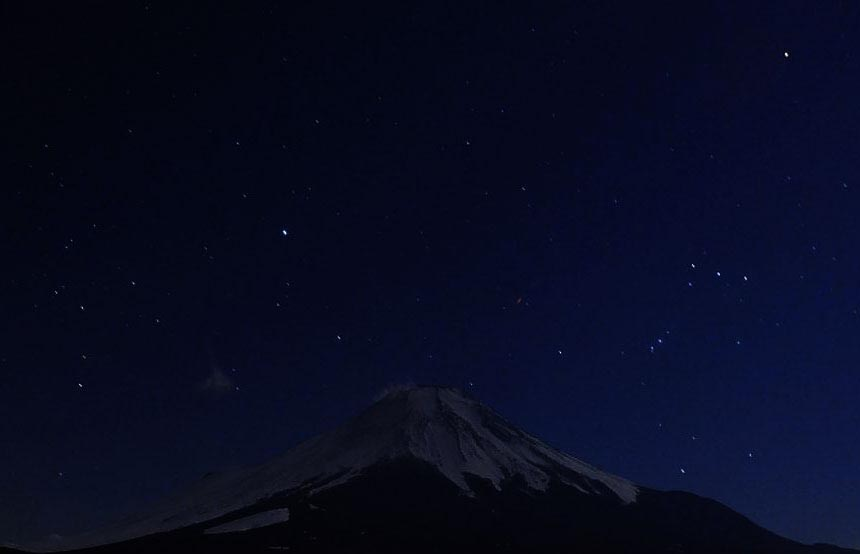
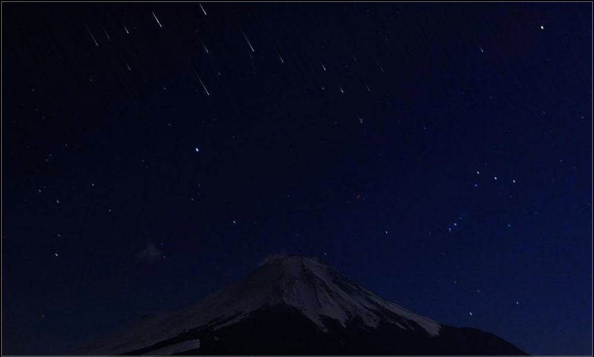

# canvas 实现流星雨

> 文章基于 `Vue3 + Vite + TypeScript` 实现。

## 1. 画一颗流星

### 1.1 分析

流星的特点：

流星就是一个小石头，然后因为速度过快产生大量的热量带动周围的空气发光发热，所以经飞过的地方看起来就像是流星的尾巴。
我们先研究一下流星这个图像，整个流星处于他自己的运动轨迹之中，当前的位置最亮，轮廓最清晰，而之前划过的地方离当前位置轨迹距离越远就越暗淡越模糊。

上面的分析结果很关键，`canvas` 上是每一帧就重绘一次，每一帧之间的时间间隔很短。
流星经过的地方会越来越模糊最后消失不见，那有没有可以让画布画的图像每过一帧就变模糊一点而不是全部清除的办法？
如果可以这样，就可以把每一帧用线段画一小段流星的运动轨迹，最后画出流星的效果。


什么？ 不像？ 我们把它画小点，这下总该像了吧？


### 1.2 代码实现

```html
<!-- OneStar.vue -->

<script lang="ts">
  import { defineComponent, onMounted, ref } from "vue";

  // 坐标
  class Crood {
    public x: number;
    public y: number;

    constructor(x: number = 0, y: number = 0) {
      this.x = x;
      this.y = y;
    }
    setCrood(x: number, y: number) {
      this.x = x;
      this.y = y;
    }
    copy() {
      return new Crood(this.x, this.y);
    }
  }

  // 流星
  class ShootingStar {
    public init: Crood;
    public final: Crood;
    public size: number;
    public speed: number; // 速度：像素/s
    public dur: number; // 飞行总时间，单位 ms
    public pass: number; // 已过去的时间
    public prev: Crood;
    public now: Crood;
    public onDistory: Function | null;

    constructor(init = new Crood(), final = new Crood(), size = 3, speed = 200, onDistory: Function | null = null) {
      this.init = init; // 初始位置
      this.final = final; // 最终位置
      this.size = size; // 大小
      this.speed = speed; // 速度：像素/s

      // 飞行总时间
      this.dur =
        (Math.sqrt(Math.pow(this.final.x - this.init.x, 2) + Math.pow(this.final.y - this.init.y, 2)) * 1000) /
        this.speed;

      this.pass = 0; // 已过去的时间
      this.prev = this.init.copy(); // 上一帧位置
      this.now = this.init.copy(); // 当前位置
      this.onDistory = onDistory;
    }
    draw(ctx: CanvasRenderingContext2D, delta: number) {
      this.pass += delta;
      this.pass = Math.min(this.pass, this.dur);

      let percent = this.pass / this.dur;

      this.now.setCrood(
        this.init.x + (this.final.x - this.init.x) * percent,
        this.init.y + (this.final.y - this.init.y) * percent,
      );

      ctx.strokeStyle = "#fff";
      ctx.lineCap = "round";
      ctx.lineWidth = this.size;

      ctx.beginPath();
      ctx.moveTo(this.now.x, this.now.y);
      ctx.lineTo(this.prev.x, this.prev.y);
      ctx.stroke();
      ctx.closePath();

      this.prev.setCrood(this.now.x, this.now.y);
      if (this.pass === this.dur) {
        this.distory();
      }
    }
    distory() {
      this.onDistory && this.onDistory();
    }
  }

  export default defineComponent({
    setup() {
      const canvasRef = ref<null | HTMLCanvasElement>(null);

      onMounted(() => {
        let cvs = canvasRef.value as HTMLCanvasElement;
        let ctx = cvs.getContext("2d") as CanvasRenderingContext2D;

        let T: number;
        let shootingStar = new ShootingStar(new Crood(100, 100), new Crood(400, 400), 3, 200, () => {
          cancelAnimationFrame(T);
        });

        let tick = (function () {
          let now = new Date().getTime();
          let last = now;
          let delta: number;

          return function () {
            delta = now - last;
            delta = delta > 500 ? 30 : delta < 16 ? 16 : delta;
            last = now;

            T = requestAnimationFrame(tick);

            // 实现关键点
            ctx.save();
            ctx.fillStyle = "rgba(0, 0, 0, 0.2)"; // 每一帧用 “半透明” 的背景色覆盖画布，使得之前画的内容隐藏一部分
            ctx.fillRect(0, 0, cvs.width, cvs.height);
            ctx.restore();

            shootingStar.draw(ctx, delta);
          };
        })();

        tick();
      });

      return {
        canvasRef,
      };
    },
  });
</script>

<template>
  <div class="wrapper">
    <canvas id="myCanvas" ref="canvasRef" width="1000" height="600"></canvas>
  </div>
</template>

<style scoped lang="scss">
  .wrapper {
    margin: 60px auto 0;
    text-align: center;

    #myCanvas {
      border: 1px solid gray;
    }
  }
</style>
```

### 1.3 效果


## 2. 流星雨

我们再加一个流星雨 `MeteorShower` 类，生成多一些随机位置的流星，做出流星雨。

### 2.1 实现

```html
<!-- MeteorShower.vue -->
<script lang="ts">
  import { defineComponent, onMounted, ref } from "vue";

  // 省略 ...

  // 流星雨
  class MeteorShower {
    public cvs: HTMLCanvasElement;
    public ctx: CanvasRenderingContext2D;
    public stars: ShootingStar[];
    public T: number;
    public stoped: Boolean;
    public playing: Boolean;

    constructor(cvs: HTMLCanvasElement, ctx: CanvasRenderingContext2D) {
      this.cvs = cvs;
      this.ctx = ctx;
      this.stars = [];
      this.T = 0;
      this.stoped = false;
      this.playing = false;
    }

    // 生成随机位置的流星
    createStar() {
      let angle = Math.PI / 3;
      // Math.random() 为 (0, 1) 之间的随机值，所以 distance 区间为 (0, 400)
      let distance = Math.random() * 400; // 移动的距离
      let init = new Crood((Math.random() * this.cvs.width) | 0, (Math.random() * 100) | 0);
      let final = new Crood(init.x + distance * Math.cos(angle), init.y + distance * Math.sin(angle));

      let size = Math.random() * 2;
      let speed = Math.random() * 400 + 100; // 速度： 像素/s

      let star = new ShootingStar(init, final, size, speed, () => {
        this.remove(star);
      });
      return star;
    }

    remove(star: ShootingStar) {
      this.stars = this.stars.filter((s) => {
        return s !== star;
      });
    }

    update(delta: number) {
      if (!this.stoped && this.stars.length < 20) {
        this.stars.push(this.createStar());
      }
      this.stars.forEach((star) => {
        star.draw(this.ctx, delta);
      });
    }

    tick() {
      if (this.playing) return;
      this.playing = true;

      let now = new Date().getTime();
      let last = now;
      let delta;

      let _tick = () => {
        if (this.stoped && this.stars.length === 0) {
          cancelAnimationFrame(this.T);
          this.playing = false;
          return;
        }

        delta = now - last;
        delta = delta > 500 ? 30 : delta < 16 ? 16 : delta;
        last = now;

        this.T = requestAnimationFrame(_tick);

        this.ctx.save();
        this.ctx.fillStyle = "rgba(0, 0, 0, 0.2)"; // 每一帧用 “半透明” 的背景色清除画布
        this.ctx.fillRect(0, 0, this.cvs.width, this.cvs.height);
        this.ctx.restore();
        this.update(delta);
      };

      _tick();
    }

    // 开始
    start() {
      this.stoped = false;
      this.tick();
    }

    // 暂停
    pause() {
      this.stoped = true;
    }
  }

  export default defineComponent({
    setup() {
      const canvasRef = ref<null | HTMLCanvasElement>(null);

      onMounted(() => {
        let cvs = canvasRef.value as HTMLCanvasElement;
        let ctx = cvs.getContext("2d") as CanvasRenderingContext2D;

        let meteorShower = new MeteorShower(cvs, ctx);
        meteorShower.start();
      });

      return {
        canvasRef,
      };
    },
  });
</script>

<template>
  <div class="wrapper">
    <canvas id="myCanvas" ref="canvasRef" width="1000" height="600"></canvas>
  </div>
</template>

<style scoped lang="scss">
  .wrapper {
    position: absolute;
    top: 50%;
    left: 50%;
    transform: translate(-50%, -50%);
    width: 100%;
    max-width: 1000px;

    #myCanvas {
      position: relative;
      width: 100%;
      border: 1px solid gray;
      box-sizing: border-box;
    }
  }
</style>
```

### 2.2 效果


## 3. 透明背景

### 3.1 分析

可以看到上面的代码中，每一帧，我们用了透明度为 `0.2` 的黑色刷了一遍画布，背景漆黑一片，如果说我们的需求是透明背景呢？

比如，我们要用这个夜景图片做背景，然后在上面加上我们的流星，我们每一帧刷一层背景的小伎俩就用不了啦。
因为我们要保证除开流星之外的部分，应该是透明的。



这里就需要用到 `globalCompositeOperation` 属性了。

对于我们来说，原图像是每一帧画完的所有流星，目标图像是画完流星之后半透明覆盖画布的黑色矩形。
而我们每一帧要保留的就是，上一帧 `0.8` 透明度的流星，覆盖画布黑色矩形我们不能显示。

注意这里的 `destination-out` 和 `destination-in`，示例中这两个属性最终都只有部分源图像保留了下来，符合我们只要保留流星的需求。

- `destination-in`: 只保留了源图像（矩形）和目标图像（圆）交集区域的源图像
- `destination-out`: 只保留了源图像（矩形）减去目标图像（圆）之后区域的源图像

这个属性支持`半透明的计算`。源图像和目标图像交叠的部分以半透明的形式保留了下来。
也就是说如果我们要保留 `0.8` 透明度的流星，可以这样设置 `globalCompositeOperation`：

```js
ctx.fillStyle = 'rgba(0, 0, 0, 0.8)';
globalCompositeOperation = 'destination-in';
ctx.fillRect(0, 0, cvs.width, cvs.height);

// 或者
ctx.fillStyle = 'rgba(0, 0, 0, 0.2)';
globalCompositeOperation = 'destination-out';
ctx.fillRect(0, 0, cvs.width, cvs.height);
```

### 3.2 实现

```html
<script lang="ts">
  import { defineComponent, onMounted, ref } from "vue";

  // 省略...

  // 流星雨
  class MeteorShower {
    // 省略...

    tick() {
      // 省略...

      let _tick = () => {
        // 省略...

        // 关键点
        this.ctx.save();
        this.ctx.globalCompositeOperation = "destination-in";
        this.ctx.fillStyle = "rgba(0, 0, 0, 0.8)"; // 每一帧用 “半透明” 的背景色清除画布
        this.ctx.fillRect(0, 0, this.cvs.width, this.cvs.height);
        this.ctx.restore();
        this.update(delta);
      };

      _tick();
    }
    // 省略...
  }

  export default defineComponent({
    setup() {
      // 省略...
    },
  });
</script>

<template>
  <div class="wrapper">
    <canvas id="myCanvas" ref="canvasRef" width="2000" height="1200"></canvas>
  </div>
</template>

<style scoped lang="scss">
  .wrapper {
    position: absolute;
    top: 50%;
    left: 50%;
    transform: translate(-50%, -50%);
    background: url(./bg.jpg) no-repeat center;
    background-size: cover;
    width: 100%;
    max-width: 1000px;

    #myCanvas {
      position: relative;
      width: 100%;
      border: 1px solid gray;
      box-sizing: border-box;
    }
  }
</style>
```

### 3.3 效果



## 4. 参考

- [教你用 canvas 画一场流星雨](https://segmentfault.com/a/1190000008664249)
