# 无损设计协同技术方案梳理

## 1. 背景


解决以下三个问题：

1. 降低设计与前端的沟通成本
2. 提高设计的工作效率
3. 提高前端的工作效率

## 2. 设计协同方案

### 2.1 有损

以 设计系统 为中心的「有损」设计协同，具体而言，就是为设计系统提供两套组件实现：

1. 一套是给设计师使用的 `Sketch` 或 `Figma` 组件库
2. 一套是给前端用的 `React` 或 `Vue` 组件库

基于此的工作流程一般为：

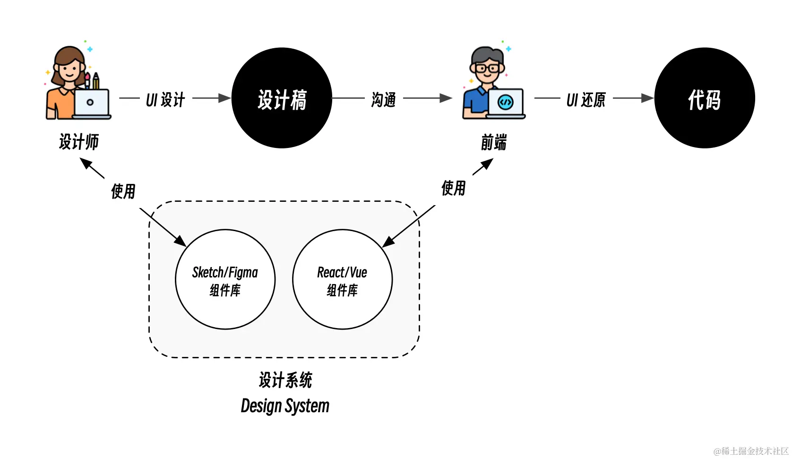

存在问题：

设计规范存在两套相互独立的实现，

1. 实现一：设计资产
2. 实现二：组件代码

这就导致二者并不同源。

### 2.2 无损

其核心思路是：通过工程化的手段，打通设计和前端，统一协作语言。

具体做法为：

1. 设计系统的组件实现，有且仅有一套组件代码。
2. 设计师使用的设计资产，利用组件代码，通过 `C2D(Code to Design)` 技术动态生成的，以此保证两者的同源。
3. `C2D` 生成设计稿时，自动注入组件元数据，包括组件名、组件参数等开发相关的细节；
4. 在 `D2C` 阶段，自动解析此「元数据」，便可以直接将设计稿翻译成组件代码。


此方案的好处主要有：

1. 低维护成本，因为只需在开发侧维护一套组件库即可。
2. 降低沟通成本，因为设计细节无损保存在元数据中，免去了双方的反复确认。
3. 提高研发效率，因为前端可利用 `D2C` 一键还原 `UI`, 免去人肉还原 `UI` 的繁琐过程。

### 2.3 确定技术方案

综上两者的优缺点及后续的维护成本，选择 无损 协同方案。

大致研发流程如下：

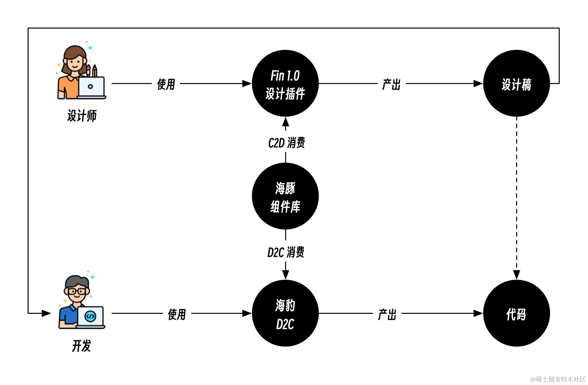

所谓 `C2D`, 全称是 `Code2Design`, 也就是将代码转成设计稿。

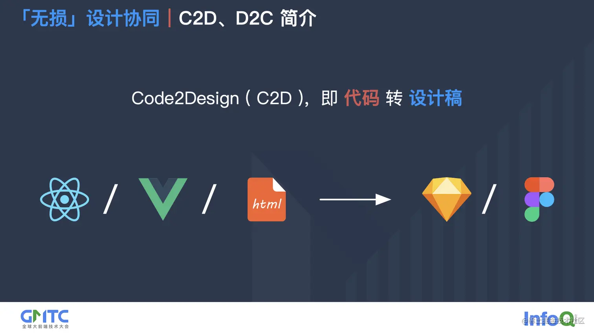

而 `D2C`, 则是其逆过程，将设计稿转成代码。


核心思路：

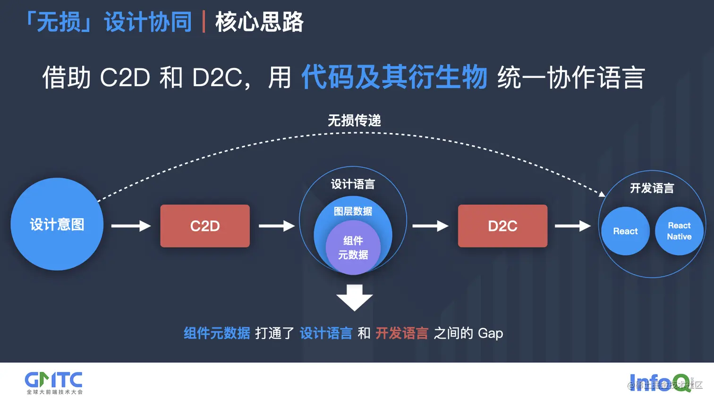

## 3. 实现原理

1. 基于 `ElementPlus` 或其他组件库的组件，实现各种不同的组合，生成对应的 `html`, 绑定对应的元数据和配置项；
2. `C2D`: `Code2Design`, 基于 `html2Sketch` 或者 `html2Figma` 的 `Sketch`, `Figma`, `MasterGo` 等设计工具的插件支持；
3. `D2C`: `Design2Code`, 基于 `Sketch`, `Figma`, `MasterGo` 等设计工具插件，实现生成选中区域图层节点转为 `UI2Schema`;
4. 基于 `UI2Schema` 转为 `LowcodeEngine` 等低代码平台支持的 `schema`;

## 4. 具体实现

### 4.1 基于 Library 的 C2D 方案

通过 `html2figma` 实现了 `Library` 的自动化生产：

以 `Button` 为例：

1. 首先，通过脚本在网页上渲染出所有的 `Button` 变体；
2. 然后，利用 `html2figma` 技术，将其批量转换成组件变体，并注入元数据。
3. 如果需要支持 `MasterGo`, 利用 `MasterGo` 「导入 `Figma` 文件」的功能即可，不用重新实现。

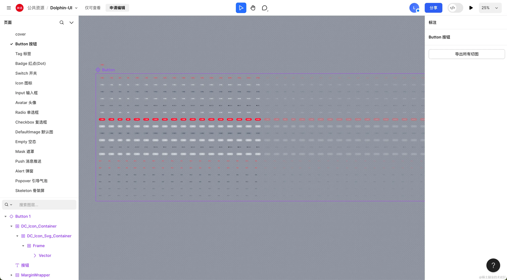

它的具体思路是，我们将组件的代码库，通过 `C2D` 技术，也就是 `Code to Design`, 将其转换成设计软件的 `Library`, 并同步诸如组件相关的元数据。
这样设计师在使用 `Library` 的时候，通过元数据就自动实现了对组件的标注，最后在 `D2C` 的过程中将就会被识别出来。

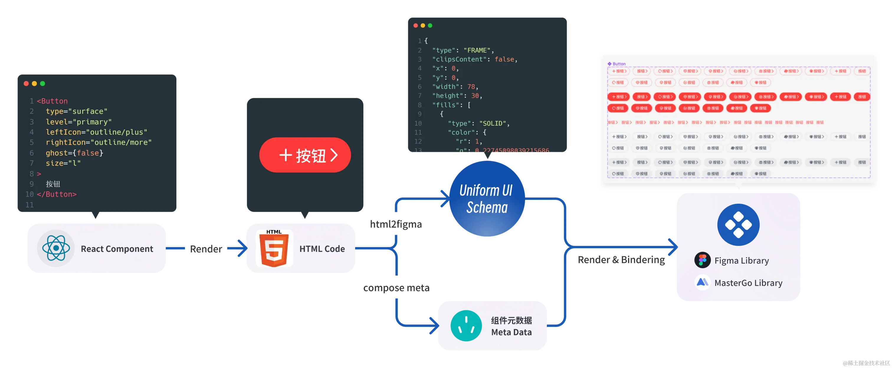

具体而言，就是将 `HTML` 的元素，比如对于 `div` 标签、`p` 标签、`svg` 标签，可以依次映射成 `Figma` 的 `Frame` 节点、文字节点和矢量节点。
按照其在 `React` 组件库中的组件名称，到 `Figma` 中，在 `Library` 中实现相应的组件。

### 4.2 C2D 插件

设计与实现：

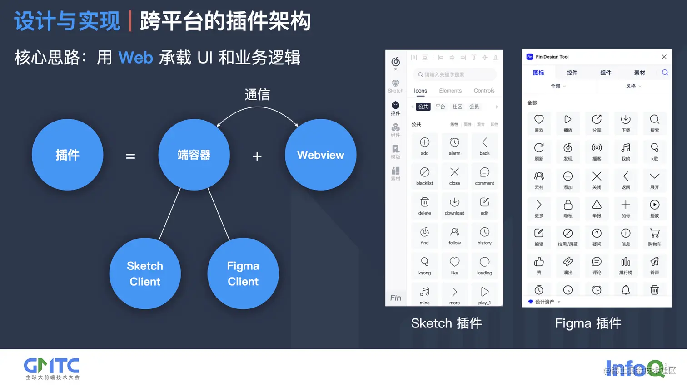

基于 4.1 生成的 `Library`, 作为 `Sketch`, `Figma`, `MasterGo` 等平台的插件内容。
实现设计工具基于现有 `UI` 组件库生成，配置出可以识别的设计页面。

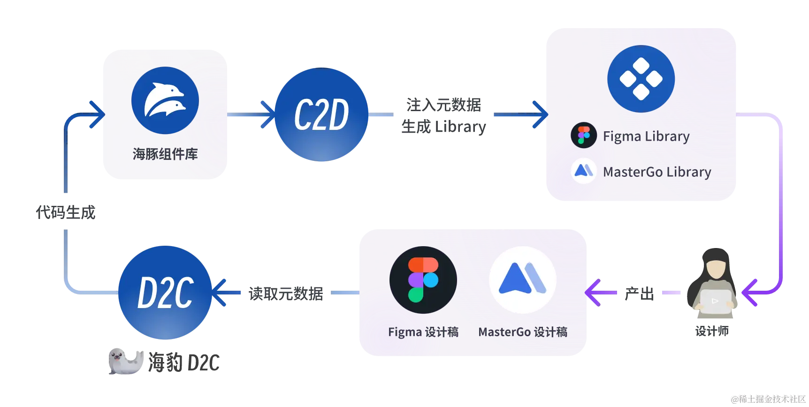

这里截图显示的就是我们通过 `C2D` 技术生成的 `Library`, 以 `Button` 为例，当设计师使用了 `Library` 中的 `Button` 后，借助组件变体和属性功能，便可以像使用 `React` 组件一样，随意更改组件的属性，并且能够在 `D2C` 阶段通过元数据识别出来。

配置化的核心是动态表单 + 元数据绑定。从设计师视角来看，配置行为可以分为「首次配置」和「二次配置」

1. 首次配置时，用户直接从插件中将所需要的组件拖拽出来，通过 `C2D`, 将目标组件转成图层信息，同时将组件的配置信息，也就是组件元数据绑定到图层上。
2. 二次配置时，当用户点击图层时，会触发插件从图层读取组件元数据，并利用动态表单渲染出配置面板，这样用户便可以实现二次的配置

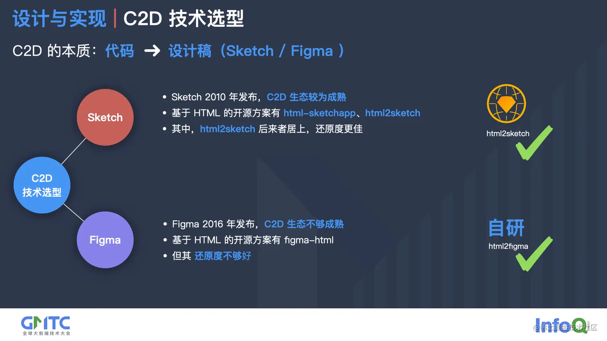

### 4.3 D2C 插件

基于 元数据 的 `D2C` 方案：

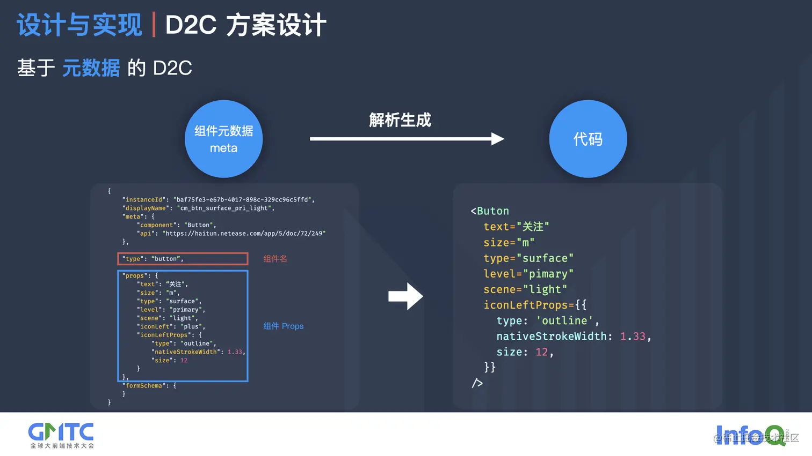

比如活动页等缺少元数据的场景，如何处理呢？暂不考虑这种场景，如果支持的话，仅考虑可推断出元数据等简单场景。

核心流程为：

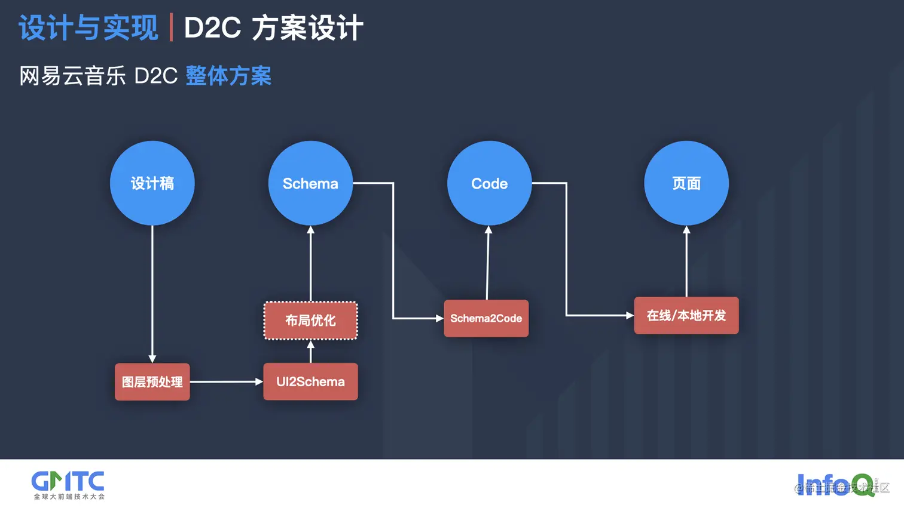

### 4.4 UI2Schema DSL 的设计

因为图层会有很多不必要的信息，且图层中是绝对定位，需要转为相对定位等布局，所以需要兼容不同平台的数据差异，清洗不必要的信息和转化易读可维护的配置信息，
那么就需要一套统一的 `Schema` 结构。

那么就需要先做图层预处理，主要目的是精简图层，降低 `D2C` 的复杂度。
因为对于一个图层而言，如果包含元数据，则证明它能够被识别成一个已知的组件，其子图层已没有太多价值，可以被完全被移除掉。
所以，图层预处理，能在很大程度上降低图层解析的复杂度。

图层精简完后，就到了第二步 `UI2Schema`.
`UI2Schema` 主要目的是将设计稿转成与平台无关的中间产物，这里的平台既包括 Sketch/Figma 这样的设计平台，也包括 `React`、`RN` 这样的代码平台。


每个节点只有两个属性, `componentName` 和 `props`:

```ts
interface NodeDSL {
  componentName: string;
  props?: Record<string, any>;
}

type DSL = NodeDSL[];
```

利用 `Figma` / `MasterGo` 的 `Component` 和 `Variant` 能力，就能释放强大的表达能力（有点类似前端的可视化搭建）:

```ts
type Page = DSL[];

const page: Page = [
  {
    componentName: 'StatusBar',
    props: {
      title: '歌单列表 & 专辑卡片',
    },
  },
  {
    componentName: 'List',
    props: {
      title: '歌单列表',
      content: [
        {
          title: '说唱力 MAX',
          subTitle: '曲风：说唱',
          icon: '🔥',
        },
        {
          title: '粤语老歌',
          subTitle: '曲风：粤语',
          icon: '🎵',
        },
      ],
    },
  },
  {
    componentName: 'Card',
    props: {
      title: '推荐专辑',
      content: [
        {
          title: '语重心长',
          tag: '林宥嘉',
          icon: '🎵',
        },
        {
          title: '灿烂人生',
          tag: '林忆莲',
          icon: '🎧',
        },
      ],
    },
  },
];
```

### 4.5 布局优化

为了能够生成可读性好、能二次开发的代码，势必要对布局进行优化。而布局优化的本质就是将 扁平的结构 转换成 行列嵌套 结构。

例如下图中，左下角有个设计稿，包含 `ABCD` 四个节点，如果不进行布局优化，那么整个页面将是一个扁平的结构，生成的是绝对定位的代码。虽然还原度能够保证，但是可读性比较差。

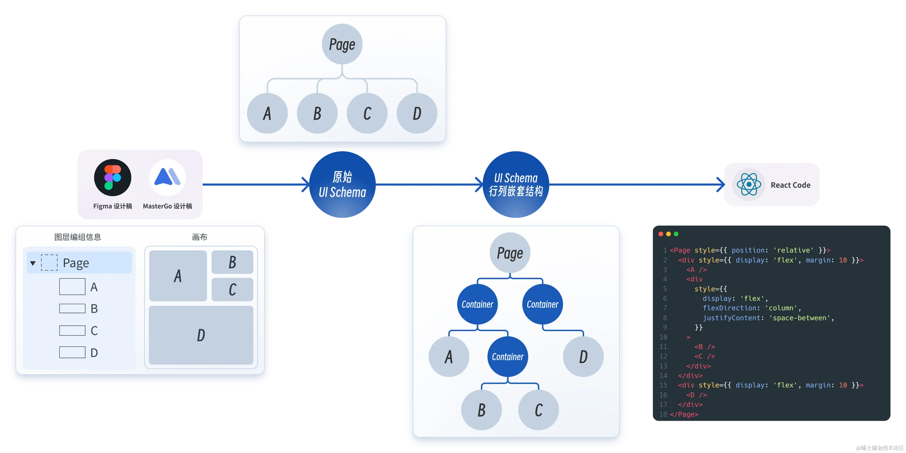
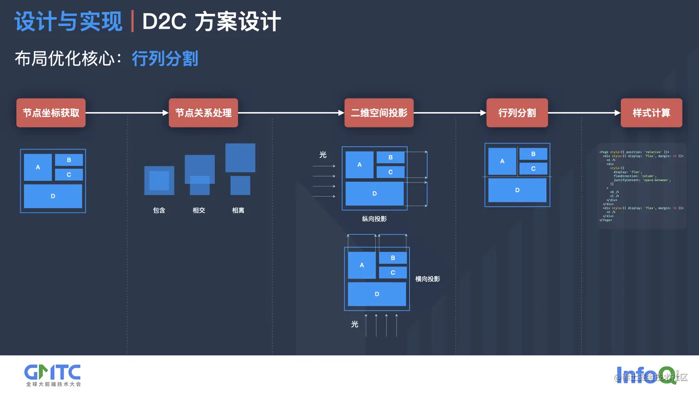

### 4.6 生成代码（LowcodeSchema）

基于以上的 `UI2Schema`, 就可以根据需要生成对应的页面代码。
注：这里是不含业务逻辑在内的，仅生成 `UI` 相关内容，开发同学专注于业务逻辑的部分开发。

- 基于生成的 `Schema`导入到 `LowcodeEngine` 等低代码平台即可完成页面的自动搭建和更新；
- 直接嵌入低代码平台的页面预览能力即可实现实时预览；

## 5. 进阶

### 5.1 在线版

生产代码环节，直接调低代码平台提供的接口服务，自动导入 `schema` 信息然后跳转到对应的项目预览查看。

### 5.2 AI 智能化支持

1. 将 `D2C` 生成的节点 `CSS` 输入给 `LLM`, 让其对 `className` 进行语义化；

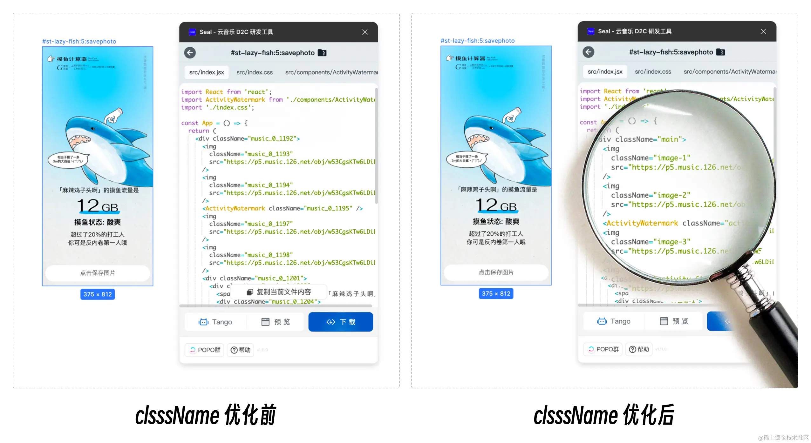

2. 设计全流程支持：


文生稿：

- 赋能产品 / 运营，将「文字需求稿」转换成高保真的设计稿，减少沟通环节。
- 赋能设计师，提供低成本的创意、灵感来源和竞品分析能力。

文生图：

- 赋能设计师，降低插画生产的时间成本。
- 基于 `DreamMaker` 二次封装，提供易用的文生图功能，降低文生图使用门槛。
- `DreamMaker` 为内部平台，消除了数据安全的隐患。

文生 `ICON`:

- 赋能设计师，降低 `ICON` 生产的时间成本。

整理流程为：

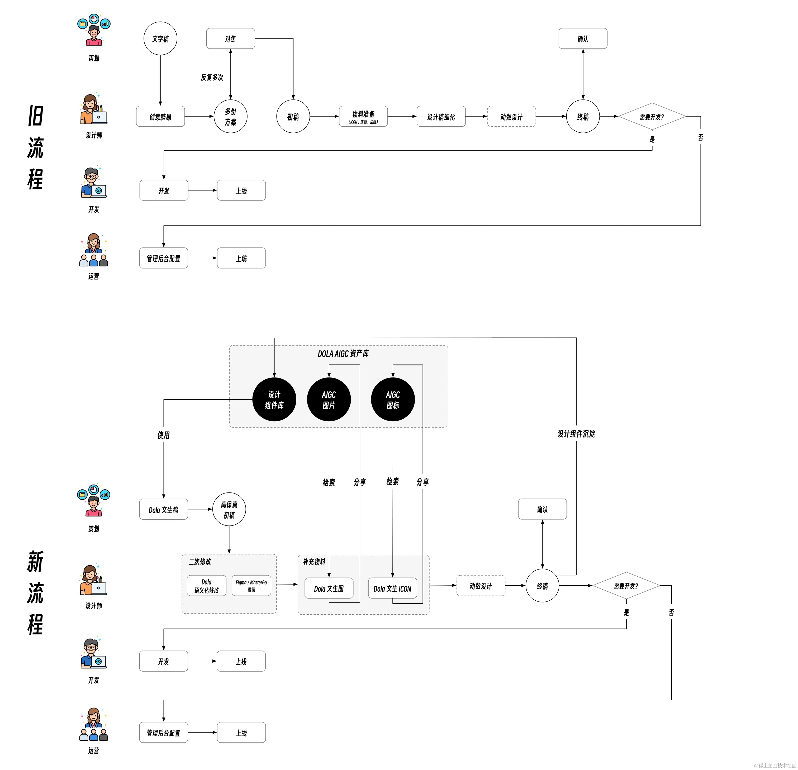

## 6. 参考

- [网易云音乐设计协同演进之路](https://juejin.cn/post/7317193434733150223)
- [网易云音乐基于 C2D2C 的「无损」设计协同](https://juejin.cn/post/7205016004924293157)
- [云音乐 D2C 设计稿转代码建设实践](https://juejin.cn/post/7317478551628103695)
- [D2C 设计方案调研：FigmaToCode 设计稿转代码 布局方案剖析](https://juejin.cn/post/7252546940105179194)
- [如何使用 Fin2.0 文生图登上云音乐首页](https://zhuanlan.zhihu.com/p/666741239)
- [C2D2C 功能演示](https://crazynote.v.netease.com/2023/0209/4422069aef7c817e5ec1bfb157fda38e.mp4)
