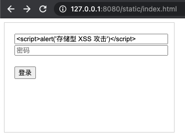
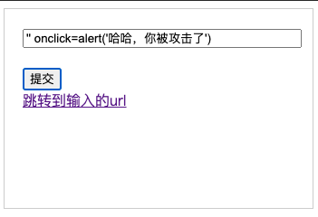
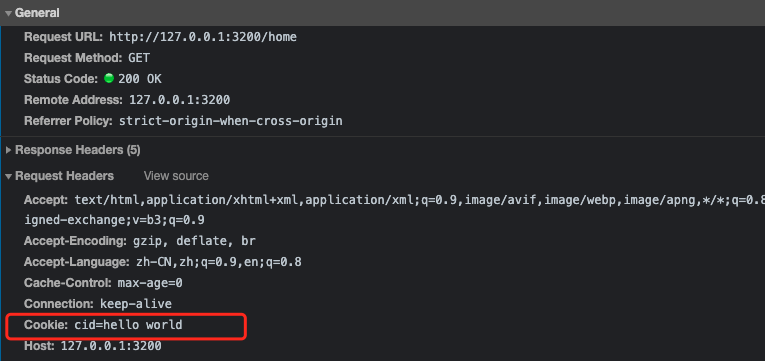

# Web 安全之 XSS 实例解析

## 1. XSS 介绍

`跨站脚本攻击（Cross Site Script）`，本来缩写是 CSS，但是为了和`层叠样式表（Cascading Style Sheet, CSS）`有所区分，所以安全领域叫做`“XSS”`；

`XSS 攻击`，通常是指攻击者通过 `“HTML 注入”`篡改了网页，插入了恶意的脚本，从而在用户浏览网页时，对用户的浏览器进行控制或者获取用户的敏感信息（Cookie, SessionID 等）的一种攻击方式。

页面被注入了恶意 JavaScript 脚本，浏览器无法判断区分这些脚本是被恶意注入的，还是正常的页面内容，所以恶意注入 Javascript 脚本也拥有了所有的脚本权限。如果页面被注入了恶意 JavaScript 脚本，它可以做哪些事情呢？

- `可以窃取 cookie 信息`。

  - 恶意 JavaScript 可以通过“doccument.cookie“获取 cookie 信息，然后通过 XMLHttpRequest 或者 Fetch 加上`CORS （Cross-Origin Resource Sharing，跨域资源共享）`功能将数据发送给恶意服务器；
  - 恶意服务器拿到用户的 cookie 信息之后，就可以在其他电脑上模拟用户的登录，然后进行转账操作。

- `可以监听用户行为。`恶意 JavaScript 可以使用"addEventListener"接口来监听键盘事件，比如可以获取用户输入的银行卡等信息，又可以做很多违法的事情。

- 可以`修改 DOM`伪造假的登录窗口，用来欺骗用户输入用户名和密码等信息。

- 还可以在页面内生成浮窗广告，这些广告会严重影响用户体验。

## 2. XSS 攻击

XSS 攻击可以分为三类：`反射型`，`存储型`，`基于 DOM 型(DOM based XSS)`。

### 2.1 反射型

恶意脚本作为网络请求的一部分。

```js
// server.js

const Koa = require('koa'); // Koa官网：https://koa.bootcss.com/
const app = new Koa();
const cors = require('@koa/cors'); // https://github.com/koajs/cors/
const bodyParser = require('koa-bodyparser');
const route = require('koa-route');

app.use(bodyParser()); // 处理post请求的参数

function xssServer(ctx) {
  // ctx.body 即服务端响应的数据
  ctx.body = '<script>alert("反射型 XSS 攻击")</script>';
}

app.use(cors());

// XSS反射型之网络请求恶意脚本
app.use(route.get('/xss-server', xssServer));

app.listen(3000, () => {
  console.log('启动成功');
});
```

执行 `node server.js`后，访问 `http://127.0.0.1:3000/xss-server` 可以看到 `页面 alert 语句` 执行：


举一个常见的场景，我们通过页面的 url 的一个参数来控制页面的展示内容，比如下面这样：

```js
// server.js

function xssParams(ctx) {
  // ctx.body 即服务端响应的数据
  ctx.body = ctx.query.userName;
}

// XSS反射型之请求恶意参数
app.use(route.get('/xss-params', xssParams));
```

此时访问 `http://127.0.0.1:3000/xss-params?userName=xiaoming` 可以看到页面上展示了 xiaoming，此时我们访问 `http://127.0.0.1:3000/xss-params?userName=<script>alert("反射型 XSS 攻击")</script>`, 可以看到页面弹出 alert。


通过这个操作，我们会发现用户将一段含有恶意代码的请求提交给服务器，服务器在接收到请求时，又将恶意代码反射给浏览器端，这就是反射型 XSS 攻击。
另外一点需要注意的是，Web 服务器`不会存储`反射型 XSS 攻击的恶意脚本，这是和存储型 XSS 攻击不同的地方。

在实际的开发过程中，我们会碰到这样的场景：
在页面 A 中点击某个操作，这个按钮操作是需要登录权限的，所以需要跳转到登录页面，登录完成之后再跳转会 A 页面。
我们是这么处理的：
跳转登录页面的时候，会加一个参数 returnUrl，表示登录完成之后需要跳转到哪个页面，即这个地址是这样的 http://test.com/login?returnUrl=http://test.com/A。
假如这个时候把 returnUrl 改成一个 script 脚本，而你在登录完成之后，如果没有对 returnUrl 进行`合法性判断`，而直接通过 `window.location.href = returnUrl`，这个时候这个恶意脚本就会执行。

### 2.2 存储型

存储型会把用户输入的数据“存储”在服务器。

比较常见的一个场景就是：
攻击者在社区或论坛写下一篇包含恶意 JavaScript 代码的博客文章或评论，文章或评论发表后，
所有访问该博客文章或评论的用户，都会在他们的浏览器中执行这段恶意的 JavaScript 代码。

存储型攻击大致需要经历以下几个步骤：

1. 首先攻击者利用站点漏洞将一段恶意 JavaScript 代码提交到网站数据库中；
2. 然后用户向网站请求包含了恶意 JavaScript 脚本的页面；
3. 当用户浏览该页面的时候，恶意脚本就会将用户的 cookie 信息等数据上传到服务器；


举一个简单的例子，一个登录页面，点击登录的时候，把数据存储在后端，登录完成之后跳转到首页，首页请求一个接口将当前的用户名显示到页面。

```
目录结构
.
├── server
|    └── index.js
├── web
|    ├── static
|    |    └── index.html
|    └── index.js
```

客户端代码：

```html
<!-- web/static/index.html -->

<!doctype html>
<html lang="en">
  <head>
    <meta charset="UTF-8" />
    <meta name="viewport" content="width=device-width, initial-scale=1.0" />
    <meta http-equiv="X-UA-Compatible" content="ie=edge" />
    <title>XSS-demo</title>
    <style>
      .login-wrap {
        height: 180px;
        width: 300px;
        border: 1px solid #ccc;
        padding: 20px;
        margin-bottom: 20px;
      }
      input {
        width: 300px;
      }
    </style>
  </head>

  <body>
    <div class="login-wrap">
      <input type="text" placeholder="用户名" class="userName" />
      <br />
      <input type="password" placeholder="密码" class="password" />
      <br />
      <br />
      <button class="btn">登录</button>
    </div>
  </body>
  <script>
    var btn = document.querySelector(".btn");

    btn.onclick = function () {
      var userName = document.querySelector(".userName").value;
      var password = document.querySelector(".password").value;

      fetch("http://localhost:3200/login", {
        method: "POST",
        body: JSON.stringify({
          userName,
          password,
        }),
        headers: {
          "Content-Type": "application/json",
        },
        mode: "cors",
      })
        .then(function (response) {
          return response.json();
        })
        .then(function (res) {
          alert(res.msg);
          window.location.href = "http://localhost:3200/home";
        })
        .catch((err) => {
          message.error(`本地测试错误 ${err.message}`);
          console.error("本地测试错误", err);
        });
    };
  </script>
</html>
```

客户端静态资源服务器代码：

```js
// web/index.js

const Koa = require('koa');
const app = new Koa();
const route = require('koa-route');
const KoaStatic = require('koa-static');

app.use(KoaStatic(__dirname));

app.listen(8080, () => {
  console.log('启动成功');
});
```

服务端代码：

```js
// server/index.js

const Koa = require('koa');
const app = new Koa();
const cors = require('@koa/cors');
const bodyParser = require('koa-bodyparser');
const route = require('koa-route');

// 临时用一个变量来存储，实际应该存在数据库中
let currentUserName = '';

app.use(bodyParser()); // 处理post请求的参数

function login(ctx) {
  const req = ctx.request.body;
  const userName = req.userName;
  currentUserName = userName;

  ctx.response.body = {
    msg: '登录成功',
  };
}

function home(ctx) {
  ctx.body = currentUserName;
}

app.use(cors());

app.use(route.post('/login', login));
app.use(route.get('/home', home));

app.listen(3200, () => {
  console.log('启动成功');
});
```

执行命令：

```
$ npx nodemon server/index.js
$ npx nodemon web/index.js
```

点击`登录`将输入信息提交到服务端，服务端使用变量 currentUserName 来存储当前的输入内容。
登录成功后，跳转到首页，服务端会返回当前的用户名。
如果用户输入了恶意脚本内容，则恶意脚本就会在浏览器端执行。

在用户名的输入框输入`<script>alert('存储型 XSS 攻击')</script>`，执行结果如下：




### 2.3 基于 DOM(DOM based XSS)

通过恶意脚本修改页面的 DOM 节点，是发生在前端的攻击。
基于 DOM 攻击大致需要经历以下几个步骤：

1. 攻击者构造出特殊的 URL，其中包含恶意代码；
2. 用户打开带有恶意代码的 URL；
3. 用户浏览器接受到响应后执行解析，前端 JavaScript 取出 URL 中的恶意代码并执行；
4. 恶意代码窃取用户数据并发送到攻击者的网站，冒充用户行为，调用目标网站接口执行攻击者指定的操作。

举个例子：

```html
<!doctype html>
<html lang="en">
  <head>
    <meta charset="UTF-8" />
    <meta name="viewport" content="width=device-width, initial-scale=1.0" />
    <meta http-equiv="X-UA-Compatible" content="ie=edge" />
    <title>XSS-demo</title>
    <style>
      .login-wrap {
        height: 180px;
        width: 300px;
        border: 1px solid #ccc;
        padding: 20px;
        margin-bottom: 20px;
      }
      input {
        width: 300px;
      }
    </style>
  </head>

  <body>
    <div class="login-wrap">
      <input type="text" placeholder="输入url" class="url" />
      <br />
      <br />
      <button class="btn">提交</button>
      <div class="content"></div>
    </div>
  </body>
  <script>
    var btn = document.querySelector(".btn");
    var content = document.querySelector(".content");

    btn.onclick = function () {
      var url = document.querySelector(".url").value;
      content.innerHTML = `<a href=${url}>跳转到输入的url</a>`;
    };
  </script>
</html>
```

点击提交按钮，会在当前页面插入一个超链接，其地址为文本框的内容。

在输入框输入如下内容：

```
onclick=alert('哈哈，你被攻击了')
```

执行结果如下：




首先用两个单引号闭合掉 href 属性，然后插入一个 onclick 事件。点击这个新生成的链接，脚本将被执行。

> 上面的代码是通过执行 执行 alert 来演示的攻击类型，同样你可以把上面的脚本代码修改为任何你想执行的代码，比如获取 用户的 cookie 等信息，`<script>alert(document.cookie)</script>`，同样也是可以的.

## 3. 防御 XSS

### 3.1 HttpOnly

由于很多 XSS 攻击都是来盗用 `Cookie` 的，因此可以通过 使用 `HttpOnly` 属性来防止直接通过 `document.cookie` 来获取 `cookie`。

一个 `Cookie` 的使用过程如下：

1. 浏览器向服务器发起请求，这时候没有 `Cookie`；
2. 服务器返回时设置 `Set-Cookie` 头，向客户端浏览器写入 `Cookie`；
3. 在该 `Cookie` 到期前，浏览器访问该域下的所有页面，都将发送该 `Cookie`；

`HttpOnly` 是在 `Set-Cookie` 时标记的：
通常服务器可以将某些 Cookie 设置为 HttpOnly 标志，HttpOnly 是服务器通过 HTTP 响应头来设置的。

```js
// server/index.js

function home(ctx) {
  // 简单设置一个cookie
  if (ctx.cookies.get('cid')) {
    console.log('cookie || cid:', ctx.cookies.get('cid'));
  } else {
    ctx.cookies.set('cid', 'hello world', {
      domain: '127.0.0.1', // 写cookie所在的域名
      path: '/', // 写cookie所在的路径
      expires: new Date('2021-05-19'), // cookie失效时间
      httpOnly: true, // 是否只用于http请求中获取
      overwrite: false, // 是否允许重写
    });
  }

  ctx.body = currentUserName;
}
```

执行命令：

```
$ npx nodemon server/index.js
```

执行结果：





> 需要注意的一点是：HttpOnly 并非阻止 XSS 攻击，而是能阻止 XSS 攻击后的 Cookie 劫持攻击。

### 3.2 输入和输出的检查

> 永远不要相信用户的输入。

输入检查一般是检查用户输入的数据是都包含一些特殊字符，如 `<`、`>`、`'`及`"`等。
如果发现特殊字符，则将这些字符过滤或编码。
这种可以称为 “XSS Filter”。

安全的编码函数：
针对 HTML 代码的编码方式是 HtmlEncode（是一种函数实现，将字符串转成 HTMLEntrities）

```
& --> &amp;
< --> &lt;
> --> &gt;
" --> &quot;
```

相应的， JavaScript 的编码方式可以使用 JavascriptEncode。

假如说用户输入了 `<script>alert("你被攻击了")</script>`，我们要对用户输入的内容进行过滤（如果包含了 `<script>` 等敏感字符，就过滤掉）或者对其`编码`，如果是恶意的脚本，则会变成下面这样：

```html
&lt;script&gt;alert("你被攻击了");&lt;/script&gt;
```

经过转码之后的内容，如 `<script>`标签被转换为 `&lt;script&gt;`，即使这段脚本返回给页面，页面也不会指向这段代码。

### 3.3 防御 DOM Based XSS

我们可以回看一下上面的例子：

```js
btn.onclick = function () {
  const url = document.querySelector('.url').value;
  content.innerHTML = `<a href=${url}>跳转到输入的url</a>`;
};
```

事实上，DOM Based XSS 是从 JavaScript 中输出数据到 HTML 页面里。

用户输入 `'' onclick=alert('哈哈，你被攻击了')`，然后通过 innerHTML 修改 DOM 的内容，就变成了 `<a href='' onclick=alert('哈哈，你被攻击了')>跳转到输入的 url</a>`, XSS 因此产生。

那么正确的防御方法是什么呢？从 JavaScript 输出到 HTML 页面，相当于一次 XSS 输出的过程，需要根据不同场景进行不同的编码处理：

- 变量输出到 `<script>`，执行一次 `JavascriptEncode`；
- 通过 JS 输出到 HTML 页面：
  - 输出事件或者脚本，做 JavascriptEncode 处理；
  - 输出 HTML 内容或者属性，做 HtmlEncode 处理；

会触发 DOM Based XSS 的地方有很多，比如：

- dom.interHTML
- dom.outerHTML
- document.write
- 页面中所有的 inputs 框
- XMLHttpRequest 返回的数据 ...

项目中如果用到，一定要避免在字符串中拼接不可信的数据。

### 3.3 利用 CSP

[CSP(Content Security Policy)](https://developer.mozilla.org/zh-CN/docs/Web/HTTP/CSP)即内容安全策略，是一种可信白名单机制，可以在服务端配置浏览器哪些外部资源可以加载和执行。
我们只需要配置规则，如何拦截是由浏览器自己实现的。我们可以通过这种方式来尽量减少 XSS 攻击。

通常可以通过两种方式来开启 CSP：

- 方式一：设置 HTTP Header 的 `Content-Security-Policy`：

```
Content-Security-Policy: default-src 'self'; // 只允许加载本站资源
Content-Security-Policy: img-src https://*  // 只允许加载 HTTPS 协议图片
Content-Security-Policy: child-src 'none'    // 允许加载任何来源框架
```

- 方式二：设置 meta 标签的方式：

```html
<meta http-equiv="Content-Security-Policy" content="default-src 'self'; img-src https://*; child-src 'none';" />
```

更多配置策略可以查看[Content-Security-Policy 文档](https://developer.mozilla.org/zh-CN/docs/Web/HTTP/Headers/Content-Security-Policy)

## 4. 参考

- [web 安全之 XSS 实例解析](https://mp.weixin.qq.com/s/BLzbcp7DbhYRE6XF3Nt4ww)
- [前端安全系列（一）：如何防止 XSS 攻击？](https://juejin.im/post/5bad9140e51d450e935c6d64)
- [前端安全系列之二：如何防止 CSRF 攻击？](https://juejin.im/post/5bc009996fb9a05d0a055192)
