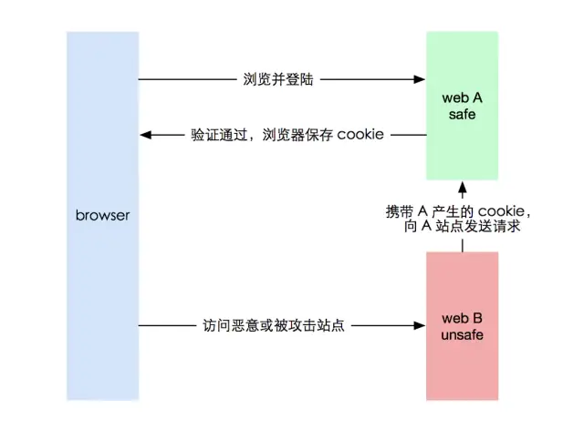
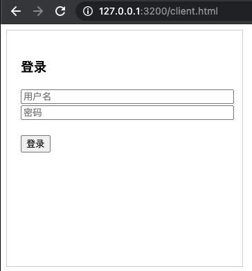
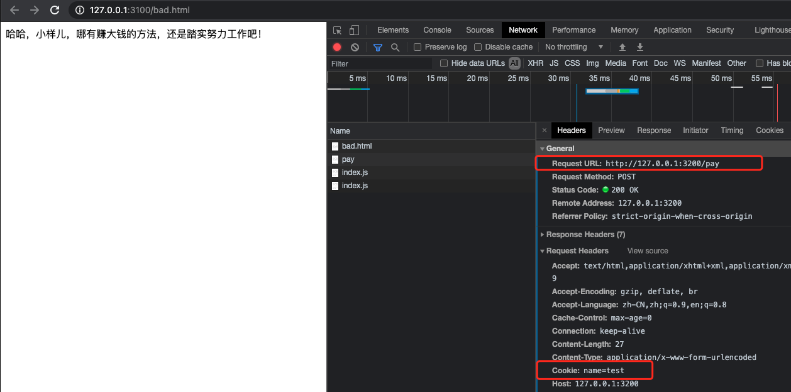
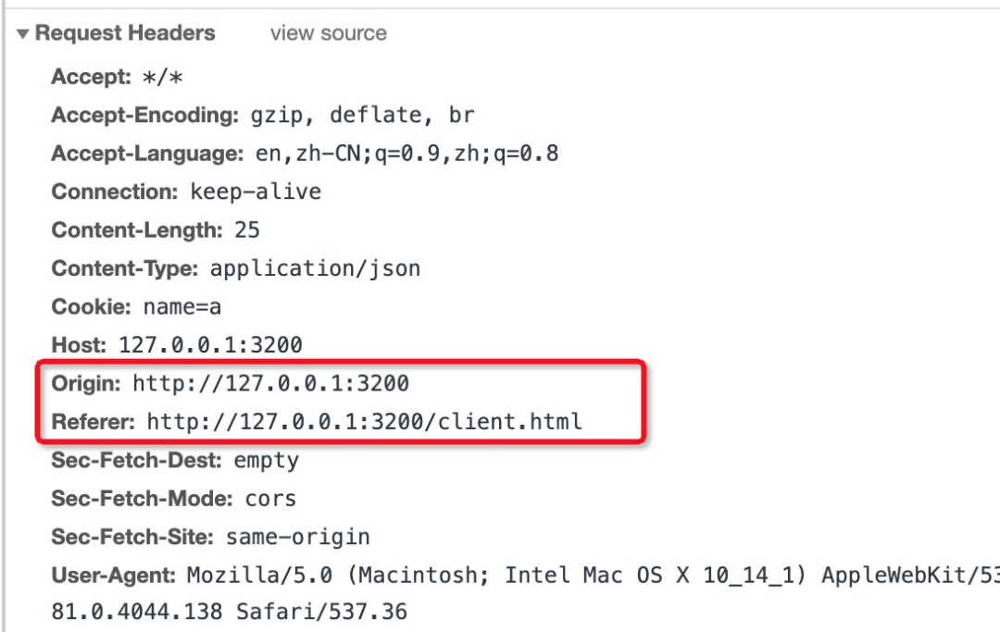

# Web 安全之 CSRF 实例解析

## 1. CSRF 介绍

`跨站请求伪造（Cross Site Request Forgery）`，是指黑客诱导用户打开黑客的网站，在黑客的网站中，利用用户的登录状态发起的跨站请求。
CSRF 攻击就是利用了用户的登录状态，并通过第三方的站点来做一个坏事。

要完成一次 CSRF 攻击,受害者依次完成两个步骤:

1. 登录受信任网站 A，并在本地生成 Cookie；
2. 在不登出 A 的情况，访问恶意网站 B；



## 2. CSRF 攻击表现

攻击场景描述如下：

1. 在 a.com 登录后种下 cookie, 然后有个支付的页面，支付页面有个诱导点击的按钮或者图片；
2. 跳转到第三方网站域名为 b.com 中的页面请求 a.com 的接口，b.com 其实拿不到 cookie，请求 a.com 会把 Cookie 自动带上（因为 Cookie 种在 a.com 域下）

这就是为什么`在服务端要判断请求的来源`，及`限制跨域（只允许信任的域名访问）`，然后除了这些还有一些方法来防止 CSRF 攻击。
下面会通过几个简单的例子来详细介绍 `CSRF 攻击的表现`及`如何防御`。

下面会通过一个例子来讲解 CSRF 攻击的表现是什么样子的。

实现的例子：在前后端同域的情况下，前后端的域名都为 `http://127.0.0.1:3200`, 第三方网站的域名为 `http://127.0.0.1:3100`，钓鱼网站页面为 `http://127.0.0.1:3100/bad.html`。

> 平时自己写例子中会用到下面这两个工具，非常方便好用：

- [http-server](https://zhuanlan.zhihu.com/p/54343488): 是基于 node.js 的 HTTP 服务器，它最大的好处就是：可以使用任意一个目录成为服务器的目录，完全抛开后端的沉重工程，直接运行想要的 js 代码；
- [nodemon](https://zhuanlan.zhihu.com/p/96720675): nodemon 是一种工具，通过在检测到目录中的文件更改时自动重新启动节点应用程序来帮助开发基于 node.js 的应用程序；

前端页面：

```html
<!-- server/client.html -->

<!DOCTYPE html>
<html lang="en">
  <head>
    <meta charset="UTF-8" />
    <meta name="viewport" content="width=device-width, initial-scale=1.0" />
    <meta http-equiv="X-UA-Compatible" content="ie=edge" />
    <title>CSRF-demo</title>
    <style>
      .wrap {
        height: 300px;
        width: 300px;
        border: 1px solid #ccc;
        padding: 20px;
        margin-bottom: 20px;
      }
      input {
        width: 300px;
      }
      .payInfo {
        display: none;
      }
      .money {
        font-size: 16px;
      }
    </style>
  </head>

  <body>
    <div class="wrap">
      <div class="loginInfo">
        <h3>登录</h3>
        <input type="text" placeholder="用户名" class="userName" />
        <br />
        <input type="password" placeholder="密码" class="password" />
        <br />
        <br />
        <button class="btnLogin">登录</button>
      </div>

      <div class="payInfo">
        <h3>转账信息</h3>
        <p>当前账户余额为 <span class="money">0</span>元</p>
        <button class="btnPay">支付10元</button>
        <br />
        <br />
        <a href="http://127.0.0.1:3100/bad.html" target="_blank">听说点击这个链接的人都赚大钱了，你还不来看一下么</a>
      </div>
    </div>
  </body>

  <script>
    const loginInfo = document.querySelector('.loginInfo')
    const payInfo = document.querySelector('.payInfo')
    const money = document.querySelector('.money')
    const btnLogin = document.querySelector('.btnLogin')
    const btnPay = document.querySelector('.btnPay')

    let currentName = ''

    // 第一次进入判断是否已经登录
    Fetch('http://127.0.0.1:3200/isLogin', 'POST', {}).then((res) => {
      if (res.data) {
        payInfo.style.display = 'block'
        loginInfo.style.display = 'none'

        // 若已登录，则展示用户账户余额
        Fetch('http://127.0.0.1:3200/pay', 'POST', { userName: currentName, money: 0 }).then((res) => {
          money.innerHTML = res.data.money
        })
      } else {
        payInfo.style.display = 'none'
        loginInfo.style.display = 'block'
      }
    })

    // 点击登录
    btnLogin.onclick = function () {
      var userName = document.querySelector('.userName').value
      currentName = userName
      var password = document.querySelector('.password').value

      // 登录请求
      Fetch('http://127.0.0.1:3200/login', 'POST', { userName, password }).then((res) => {
        payInfo.style.display = 'block'
        loginInfo.style.display = 'none'
        money.innerHTML = res.data.money
      })
    }

    // 点击支付10元
    btnPay.onclick = function () {
      Fetch('http://127.0.0.1:3200/pay', 'POST', { userName: currentName, money: 10 }).then((res) => {
        console.log(res)
        money.innerHTML = res.data.money
      })
    }

    // 封装的请求方法
    function Fetch(url, method = 'POST', data) {
      return new Promise((resolve, reject) => {
        let options = {}
        if (method !== 'GET') {
          options = {
            headers: {
              'Content-Type': 'application/json',
            },
            body: JSON.stringify(data),
          }
        }

        fetch(url, {
          mode: 'cors', // no-cors, cors, *same-origin
          method,
          ...options,
          credentials: 'include', // 带上cookie信息
        })
          .then((res) => {
            return res.json() // 结果解析为json格式
          })
          .then((res) => {
            resolve(res)
          })
          .catch((err) => {
            reject(err)
          })
      })
    }
  </script>
</html>
```

实现一个简单的支付功能：

1. 会首先判断有没有登录，如果已经登录过，就直接展示转账信息，若未登录，则展示登录信息；
2. 登录完成之后，会展示转账信息，点击支付，可以实现金额的扣减；

后端服务：

```js
// server/server.js

const Koa = require('koa');
const app = new Koa();
const cors = require('@koa/cors');
const bodyParser = require('koa-bodyparser');
const route = require('koa-route');
const KoaStatic = require('koa-static');

let currentUserName = '';

// 使用  koa-static  使得前后端都在同一个服务下
app.use(KoaStatic(__dirname));

app.use(bodyParser()); // 处理post请求的参数

// 初始金额为 1000
let money = 1000;

// 调用登录的接口
function login(ctx) {
    const req = ctx.request.body;
    const userName = req.userName;
    currentUserName = userName;

    // 简单设置一个cookie
    ctx.cookies.set('name', userName, {
        domain: '127.0.0.1', // 写cookie所在的域名
        path: '/', // 写cookie所在的路径
        maxAge: 24 * 60 * 60 * 1000, // cookie有效时长，单位毫秒。设置为24小时
        expires: new Date('2021-12-31'), // cookie失效时间
        overwrite: false, // 是否允许重写
        SameSite: 'None',
    });
    ctx.response.body = {
        data: {
            money,
        },
        msg: '登录成功',
    };
}

// 调用支付的接口
function pay(ctx) {
    // 根据有没有 cookie 来简单判断是否登录
    if (ctx.cookies.get('name')) {
        if (ctx.method === 'GET') {
            money = money - Number(ctx.request.query.money);
        } else {
            money = money - Number(ctx.request.body.money);
        }

        ctx.response.body = {
            data: {
                money,
            },
            msg: '支付成功',
        };
    } else {
        ctx.response.body = {
            data: {},
            msg: '未登录',
        };
    }
}

// 判断是否登录
function isLogin(ctx) {
    if (ctx.cookies.get('name')) {
        ctx.response.body = {
            data: true,
            msg: '登录成功',
        };
    } else {
        ctx.response.body = {
            data: false,
            msg: '未登录',
        };
    }
}

// 处理 options 请求
app.use(async (ctx, next) => {
    const headers = ctx.request.headers;

    ctx.set('Access-Control-Allow-Origin', headers.origin);
    ctx.set('Access-Control-Allow-Headers', 'Content-Type, Content-Length, Authorization, Accept, X-Requested-With');
    ctx.set('Access-Control-Allow-Methods', 'PUT, POST, GET, DELETE, OPTIONS');
    ctx.set('Access-Control-Allow-Credentials', 'true');

    if (ctx.method === 'OPTIONS') {
        ctx.status = 204;
    } else {
        await next();
    }
});

app.use(cors());

app.use(route.post('/login', login));
app.use(route.post('/pay', pay));
app.use(route.get('/pay', pay));
app.use(route.post('/isLogin', isLogin));

app.listen(3200, () => {
    console.log('启动成功');
});
```

执行命令：

```
$ npx nodemon server/server.js
```

访问页面 `http://127.0.0.1:3200/client.html`：




登录完成之后，可以看到 Cookie 是种到 `http://127.0.0.1` 这个域下面的。

第三方页面：

```html
<!-- badServer/bad.html -->

<!DOCTYPE html>
<html lang="en">
  <head>
    <meta charset="UTF-8" />
    <meta name="viewport" content="width=device-width, initial-scale=1.0" />
    <title>第三方网站</title>
  </head>
  <body>
    <div>当前访问地址：http://127.0.0.1:3100</div>
    <div>
      哈哈，小样儿，哪有赚大钱的方法，还是踏实努力工作吧！
      <!--
        Form 表单的提交会伴随着跳转到 action 中指定的 url 链接，
        为了阻止这一行为，可以通过设置一个隐藏的 iframe 页面，
        并将 Form 的 target 属性指向这个 iframe，当前页面 iframe 则不会刷新页面
      -->
      <form action="http://127.0.0.1:3200/pay" method="POST" class="form" target="targetIframe" style="display: none">
        <input type="text" name="userName" value="xiaoming" />
        <input type="text" name="money" value="100" />
      </form>
      <iframe name="targetIframe" style="display: none"></iframe>
    </div>
  </body>
  <script>
    document.querySelector('.form').submit()
  </script>
</html>
```

使用 http-server 起一个 本地端口为 3100 的服务，就可以通过 http://127.0.0.1:3100/bad.html 这个链接来访问。
CSRF 攻击需要做的就是在正常的页面上诱导用户点击链接进入这个页面。

```
$ npx http-server -p 3100 -c-1
```



点击诱导链接，跳转到第三方的页面，第三方页面自动发了一个扣款的请求，所以在回到正常页面的时候，刷新，发现钱变少了。

我们可以看到在第三方页面调用 http://127.0.0.1:3200/pay 这个接口的时候，Cookie 自动加在了请求头上。

这就是为什么 http://127.0.0.1:3100/bad.html 跨域请求 http://127.0.0.1:3200/pay 这个接口，但也能正常访问的原因。

> 注：实际测试结果：http://localhost:3100/bad.html 跨域请求 http://127.0.0.1:3200/pay，能正常请求，但不会携带Cookie。

## 3. CSRF 攻击分类

CSRF 攻击大致可以分为三种情况，自动发起 Get 请求， 自动发起 POST 请求，引导用户点击链接。
下面会分别对上面例子进行简单的改造来说明这三种情况。

### 3.1 自动发起 Get 请求

在上面的 bad.html 中，我们把代码改成下面这样

<!DOCTYPE html>
<html>
  <body>
    
  </body>
</html>

当用户访问含有这个 img 的页面后，浏览器会自动向自动发起 img 的资源请求，如果服务器没有对该请求做判断的话，那么会认为这是一个正常的链接。

### 3.2 自动发起 POST 请求

上面例子中演示的就是这种情况。

```html
<body>
  <div>
    哈哈，小样儿，哪有赚大钱的方法，还是踏实努力工作吧！
    <!-- form 表单的提交会伴随着跳转到action中指定 的url 链接，为了阻止这一行为，可以通过设置一个隐藏的iframe 页面，并将form 的target 属性指向这个iframe，当前页面iframe则不会刷新页面 -->
    <form action="http://127.0.0.1:3200/pay" method="POST" class="form" target="targetIfr">
      <input type="text" name="userName" value="xiaoming" />
      <input type="text" name="money" value="100" />
    </form>
    <iframe name="targetIfr" style="display:none"></iframe>
  </div>
</body>
<script>
  document.querySelector('.form').submit()
</script>
```

上面这段代码中构建了一个隐藏的表单，表单的内容就是自动发起支付的接口请求。
当用户打开该页面时，这个表单会被自动执行提交。
当表单被提交之后，服务器就会执行转账操作。

因此使用构建自动提交表单这种方式，就可以自动实现跨站点 POST 数据提交。

### 3.3 引导用户点击链接

诱惑用户点击链接跳转到黑客自己的网站，示例代码如下所示：

```
<a href="http://127.0.0.1:3100/bad.html">听说点击这个链接的人都赚大钱了，你还不来看一下么</a>
```

用户点击这个地址就会跳到黑客的网站，黑客的网站可能会自动发送一些请求，比如上面提到的自动发起 Get 或 Post 请求。

## 4. 如何防御 CSRF

### 4.1 利用 cookie 的 SameSite

`SameSite` 有 3 个值：`Strict`, `Lax` 和 `None`：

- Strict。
  - 浏览器会完全禁止第三方 cookie。
  - 比如 a.com 的页面中访问 b.com 的资源，那么 a.com 中的 cookie 不会被发送到 b.com 服务器，只有从 b.com 的站点去请求 b.com 的资源，才会带上这些 Cookie。
- Lax。
  - 相对宽松一些，在跨站点的情况下，从第三方站点链接打开和从第三方站点提交 Get 方式的表单这两种方式都会携带 Cookie。
  - 但如果在第三方站点中使用 POST 方法或者通过 img、Iframe 等标签加载的 URL，这些场景都不会携带 Cookie。
- None。
  - 任何情况下都会发送 Cookie 数据。

我们可以根据实际情况将一些关键的 Cookie 设置 Stirct 或者 Lax 模式。
这样在跨站点请求的时候，这些关键的 Cookie 就不会被发送到服务器，从而使得 CSRF 攻击失败。

### 4.2 验证请求的来源点

由于 CSRF 攻击大多来自第三方站点，可以在服务器端验证请求来源的站点，禁止第三方站点的请求。
可以通过 HTTP 请求头中的 Referer 和 Origin 属性。



但是这种 Referer 和 Origin 属性是可以被伪造的，碰上黑客高手，这种判断就是不安全的了。

### 4.3 CSRF Token

1. 最开始浏览器向服务器发起请求时，服务器生成一个 CSRF Token。
   CSRF Token 其实就是服务器生成的字符串，然后将该字符串种植到返回的页面中（一般不通过 Cookie，而是登录后接口传递，这样和 Cookie 做双重校验）。
2. 浏览器之后再发起请求的时候，需要带上页面中的 CSRF Token（在 request 请求头中要带上之前获取到的 Token，比如 x-csrf-token：xxxx）, 然后服务器会验证该 Token 是否合法。
   第三方网站发出去的请求是无法获取到 CSRF Token 的值的。

## 5. 其他知识点补充

### 5.1 第三方 Cookie

Cookie 是种在服务端的域名下的，比如客户端域名是 a.com，服务端的域名是 b.com。
Cookie 是种在 b.com 域名下的，在 Chrome 的 Application 下是看到的是 a.com 下面的 Cookie，是没有的。
之后，在 a.com 下发送 b.com 的接口请求会自动带上 Cookie（因为 Cookie 是种在 b.com 下的）。

> 实际没有测试成功。Cookie 种在 127.0.0.1 下面，localhost 请求 127.0.0.1 接口，Cookie 没有携带发送。

### 5.2 简单请求和复杂请求

复杂请求需要处理 option 请求。[详见这里](https://www.jianshu.com/p/5cf82f092201)。

### 5.3 Fetch 的 credentials 参数

如果没有配置 credential 这个参数，fetch 是不会发送 Cookie 的

credential 的参数如下

- include：不论是不是跨域的请求，总是发送请求资源域在本地的 Cookies、HTTP Basic anthentication 等验证信息；
- same-origin：只有当 URL 与响应脚本同源才发送 cookies、 HTTP Basic authentication 等验证信息；
- omit：从不发送 cookies。

> 实际没有测试成功。Cookie 种在 127.0.0.1 下面，localhost 请求 127.0.0.1 接口，Cookie 没有携带发送。

平常写一些简单的例子，从很多细节问题上也能补充自己的一些知识盲点。

## 6. 参考

- [Web 安全之 CSRF 实例解析](https://mp.weixin.qq.com/s/2kkqXmW_olEwD5D_CRjs6A)
- [前端安全系列（一）：如何防止 XSS 攻击？](https://juejin.im/post/5bad9140e51d450e935c6d64)
- [前端安全系列之二：如何防止 CSRF 攻击？](https://juejin.im/post/5bc009996fb9a05d0a055192)
